# 泰拉瑞亚数字电路文档 


::: {.admonition .quote}
**混乱沉睡，2025 年 12 月 25 日**


:::
## 目录 


<div STYLE="page-break-after: always;"></div>

## 绪论

泰拉瑞亚作为一款冒险游戏，拥有独具特色的电路系统。本教程旨在为泰拉瑞亚玩家、其他游戏电路和现实电路爱好者，提供一个系统、全面的了解泰拉瑞亚电路的途径。本教程专注于泰拉瑞亚中的数字电路部分，不涉及过多游戏相关内容。如果你需要了解更多泰拉瑞亚的相关信息，请参考[泰拉瑞亚维基](https://terraria.wiki.gg/zh/wiki/Terraria_Wiki "泰拉瑞亚维基")。

本教程有配套的地图，并且教程中包含的电路会以[地图编辑器简图](https://github.com/TEdit/Terraria-Map-Editor/tree/main/schematics "地图编辑器简图")的形式发布，可以在[本教程项目地址](https://github.com/yfdyzjt/TerrariaDigitalWiringTutorial "泰拉瑞亚数字电路教程")查看。

本教程分为六个章节：

* [第一章 基本概念](#第一章-基本概念)：讲解泰拉瑞亚和数字电路的基本概念；

* [第二章 电路基础](#第二章-电路基础)：讲解电路基本组成和结算逻辑；

* [第三章 逻辑电路](#第三章-逻辑电路)：讲解逻辑门电路的基本原理；

* [第四章 标准电路](#第四章-标准电路)：讲解由逻辑门构成的标准电路模块；

* [第五章 大型电路](#第五章-大型电路)：讲解大型电路的设计方法与规范；

* [第六章 电路物品](#第六章-电路物品)：讲解逻辑门以外的部分电源和用电器的用法；

在开始之前，建议安装以下模组，以帮助你更方便地进行电路制作：

* [地图编辑器 TEdit](https://github.com/TEdit/Terraria-Map-Editor/releases)

* [模组启动器 tModLoader](https://store.steampowered.com/app/1281930/)

* [电路步进模组 MechScope](https://steamcommunity.com/sharedfiles/filedetails/?id=3232991031)

* [辅助模组 HERO's Mod](https://steamcommunity.com/sharedfiles/filedetails/?id=2564645933)

此外，欢迎加入以下泰拉瑞亚电路社区，与其他玩家一起学习和讨论：

* [泰拉瑞亚电路爱好者交流群](https://qm.qq.com/q/ZXDnybyQcE)

* [The Grand Designers](https://discord.gg/qby8FSkHAW)

* [Terraria Wiring Community](https://discord.gg/s6xbNqrUY2)

本教程参考了以下其他教程，读者可以根据需要进一步阅读以加深理解：

* [泰拉瑞亚电路文档](https://github.com/putianyi889/TerrariaWiringTutorial/releases)

* [The Ultimate Community Wiring Guide](https://steamcommunity.com/sharedfiles/filedetails/?id=2832101012)

同时欢迎关注我的以下平台账号，我会在这些地方发布电路作品和教程：

* [哔哩哔哩](https://space.bilibili.com/22871583)

* [Steam 创意工坊](https://steamcommunity.com/id/yfdyzjt/myworkshopfiles/?appid=105600)

* [Github](https://github.com/yfdyzjt)


## 第一章 基本概念

*这部分涉及一些基本概念，可以先跳过，在需要时回来阅读。*

### 1.1 泰拉瑞亚

#### 1.1.1 实体

**实体** 指的是可以发生碰撞的物体，包括[NPC](https://terraria.wiki.gg/zh/wiki/NPC)、[人物（玩家）](https://terraria.wiki.gg/zh/wiki/%E4%BA%BA%E7%89%A9)、[射弹](https://terraria.wiki.gg/zh/wiki/%E5%B0%84%E5%BC%B9)、[物品（掉落物）](https://terraria.wiki.gg/zh/wiki/%E7%89%A9%E5%93%81)、[图格](https://terraria.wiki.gg/zh/wiki/%E5%9B%BE%E6%A0%BC_ID)等。


::: {.admonition .example}
史莱姆对玩家造成接触伤害，是史莱姆（NPC）与玩家（人物）的碰撞；玩家用弓射出木箭击中了史莱姆，是史莱姆（NPC）与木箭（射弹）的碰撞；玩家被血肉墙激光击中，是玩家（人物）与激光（射弹）的碰撞；玩家、物品、大多数 NPC、大多数射弹不能穿墙，是因为玩家、物品、NPC、射弹会和图格碰撞。

:::
碰撞是通过 **碰撞箱** 判定的，泰拉瑞亚中所有实体的碰撞箱均为矩形，有宽度和高度两个属性。


::: {.admonition .example}
史莱姆与玩家碰撞，是因为史莱姆的碰撞箱与玩家的碰撞箱有重叠。

:::
#### 1.1.2 上限

泰拉瑞亚中许多实体都有数量上限，而数量上限又分为 **硬上限** 和 **软上限**。硬上限是游戏中的静态常量，软上限是游戏中的变量。


::: {.admonition .example}
NPC 最多数量（硬上限） 200 ，活跃刷怪数量（软上限）一般在 5 到 15 。

:::
从程序角度来说，硬上限是由定长数组的长度决定的，如果尝试突破会导致数组越界。为避免在正常游戏过程中出现崩溃现象，游戏程序中在关键函数中都有越界检查。而软上限是开发者对游戏的平衡控制。


::: {.admonition .example}
NPC 达到上限时，游戏会拒绝生成新 NPC 以防止崩溃；玩家附近的活跃敌怪数量到达 15 则不会进行刷怪。

:::
以下是一些电路中可能用到的硬上限：

| 对象 | 上限 |
| --- | --- |
| 傀儡影子 | 100 |
| NPC | 200 |
| 人物 | 255 |
| 射弹 | 1000 |
| 冷却机关 | 1000 |

#### 1.1.3 帧率

**物理帧（tick）** 指泰拉瑞亚中时间的最小单位，为 1/60 秒。在物理帧的尺度下，泰拉瑞亚是回合制游戏，每个物理帧中，除电路外所有的游戏机制会依一定顺序结算，电路结算的位置和触发电路的物理电源结算位置有关。本教程中未经特殊说明的情况下将直接用“帧”表示物理帧。

**图像帧（frame）** 指泰拉瑞亚游戏过程中电脑显示屏更新的每帧画面，在游戏中按 F10 可以在游戏窗口左下角显示当前图像帧率。建议将跳帧设置为隐蔽以使图像帧和物理帧相等，跳帧开会在物理帧降低时通过降低图像帧以使物理帧达到最大，跳帧关会令图像帧和屏幕刷新率相等。

#### 1.1.4 坐标

图格的 **坐标** 指的是图格在世界中的位置。坐标并非深度计与罗盘所显示的那样。程序中的坐标是以世界左上角第一个图格为 (0, 0)，横坐标向右增加，纵坐标向下增加。世界右下角的坐标为 (世界宽度 - 1, 世界高度 - 1)。

以下是不同大小世界的宽度和高度，其中大世界是泰拉瑞亚中最大的世界：

| 世界 | 宽度 | 高度 |
| --- | --- | --- |
| 小世界 | 4200 | 1200 |
| 中世界 | 6400 | 1800 |
| 大世界 | 8400 | 2400 |

世界最外侧有一个区域在游戏中不可见且玩家不可到达的，区域内的图格仍然存在，可以在地图编辑器里面看到它们，世界上侧和左侧不可见区域大小是 41 格，下侧和右侧是 42 格。在不可见区域内的电路仍然可以正常运行，只有在世界最外侧 2 格宽的区域内的电路无法运行。

#### 1.1.5 度量

泰拉瑞亚中的长度单位有：**英里、格、英尺、像素**。换算关系是 1 英里 = 5280 英尺 = 2640 格，1 格 = 2 英尺 = 16 像素。


::: {.admonition .tip}
尽管泰拉瑞亚的图格贴图是按照每个图格 8 × 8 像素绘制的，但是储存和计算时仍然是按照 16 × 16 像素。

:::

::: {.admonition .info}
在游戏中最大能看到 1920 × 1080 像素的范围，即便将游戏分辨率设置的更高，也会被强制缩放到这个范围内。

:::
泰拉瑞亚中的时间单位有：**帧、秒、分、天**。换算关系是 1 天 = 24 分，1 分 = 60 秒，1 秒 = 60 帧。有的时候帧、秒、分也分别叫做游戏秒、游戏分、游戏时。

速度单位 = 长度单位/时间单位，主要有：英里/小时、格/秒、像素/帧。

程序内部的长度单位是像素，时间单位是帧，速度单位是像素/帧。

### 1.2 数字电路

#### 1.2.1 模拟电路与数字电路

在现实中存在着许多物理量，其中有一些物理量，比如温度、湿度、压力、速度等，它们在时间上和数值上都具有连续变化的特点，在一定范围内可以取任意实数值，通常称这种连续变化的物理量为 **模拟量**，表示模拟量的电信号称为 **模拟信号**。而处理模拟信号的电路称为 **模拟电路**。

还有一类物理量在时间和数值上都是离散的，它们的大小以及每次的增减变化都是某个最小单位的整数倍。比如每年的利润，若最小单位为元，显然它只能以元为单位增加或减少，并且以年为时间单位记录。这一类物理量称为 **数字量**，表示数字量的电信号称为 **数字信号**。而处理数字信号的电路称为 **数字电路**。


::: {.admonition .info}
泰拉瑞亚的电路中并没有电压和电流这样的模拟量，电源、用电器和电线的状态在时间上和数值上都是离散的，泰拉瑞亚中只存在数字电路。

:::
在数字电路中，最常用的是只由 0 和 1 两种数值组成的数字信号，这种二值数字信号又被称为 **二进制信号**，这类信号中的数值 0 或 1 可以用电平的低或高来表示，也可以用脉冲的有或无来表示。数字电路中最小时间单位被称为 **周期**，电路中所有变化都会以周期为单位发生。


::: {.admonition .info}
泰拉瑞亚逻辑门电路的周期被称为 **逻辑帧**，一个物理帧内可以有任意数量的逻辑帧。一个常见的错误是认为逻辑帧与物理帧相等，实际上在泰拉瑞亚中任意规模的电路都能在瞬间（一个物理帧内）计算完成，详细内容会在后文介绍。

:::

::: {.admonition .tip}
后文中的在描述电路时使用的“同时”指的是指某些事情在同一个周期（逻辑帧）内发生，它们的先后关系对结果没有影响。

:::
数字电路中处理的电信号一般有两种，**电平（状态）型数字信号** 和 **脉冲（激活）型数字信号**。

状态信号会在每个周期内维持一个状态（电平）不变，只有在周期间才会发生变化，一般设定高电平为 1、低电平为 0，所以又叫不归零型数字信号，通常关注状态信号在周期内的状态。

脉冲是一种特殊的信号，指电平在短时间内（小于一个周期）突变，随后又迅速返回初始值的变化过程。对于激活信号，一般设定有脉冲为 1、无脉冲为 0，在每个周期中除了有脉冲的瞬间外，会一直维持低电平，所以又叫归零型数字信号，通常关注周期内是否有脉冲存在。


::: {.admonition .info}
泰拉瑞亚的电线中传递的只有激活信号，而在电源和用电器中存在状态信号和激活信号，其中逻辑门电路中只有 0 和 1 两种数值所组成的二进制数字信号。

:::

::: {.admonition .example}
```wavedrom
{ 
  signal : [
  { name: "a", wave: "h..lhlh."},
  { name: "b", wave: "p..lplpp"}
  ],
  head : {
   tick: 0,
   every: 1
  }
}
```

上图为两个数字信号 a 与 b 的波形图，信号内容都是 $(11101011)_2$ ，波形图是反映信号的幅值（电平）随时间的变化图像。

* 信号 a 是以高电平代表 $1$ ，低电平代表 $0$ ，称为状态（电平）型数字信号或不归零型数字信号；
* 信号 b 是以有脉冲代表 $1$ ，无脉冲代表 $0$ ，称为激活（脉冲）型数字信号或归零型数字信号；

脉冲除了是方波以外，还可以是三角波、正弦波、尖顶余弦等等，我们并不关心其波形与持续时间，只关心它是否存在。

:::
#### 1.2.2 进制

按进位规则进行计数称为 **进位计数制**，简称 **进制**。在日常生活中我们最广泛使用的是 **十进制（Decimal）**，十进制有 0 ~ 9 十个数字。但在数字电路和计算机中，通常只有类似灯的亮灭、电线的通断、开关的闭合和抬起，这样的两种状态，所以只需要 0 和 1 两个数字来表示，使用的是 **二进制（Binary）**。


::: {.admonition .info}
在泰拉瑞亚逻辑门电路中，只有二进制信号，所以其它类型的信号，比如数字、文字、图像、视频、程序等信息，需要先使用特定的编码转换为二进制信号，才能在电路中传输和处理。处理完成后，由需要将二进制信号转换为其它类型的信号进行表示。

:::
十进制数可以被写做 $(345)_{10}$ ，读做“三百四十五”，这种使用 0 ~ 9 十个数字，每个数字在不同的数位上表示的大小不同的形式，被称为 **位置记数法**。


::: {.admonition .tip}
下角标 10 表示括号里的数是十进制，下角标 2 表示括号里的数是二进制，以此类推。

:::
在十进制中，由于只有 0 ~ 9 十个数字，当表示大于 9 的数时，需要进行进位，也就是满 10 进 1 ， 9 + 1 = 10 。当 1 在十位上时，它是个位上的 1 的十倍。对于十进制数 $(345)_{10}$ ，3 在百位上，4 在十位上，5 在个位上；3 代表有三个 100，4 代表有四个 10，5 代表有五个 1。这里的 100、10、1 ，也就是 $10 ^ 2$、$10 ^ 1$、$10 ^ 0$ 是十进制数的 **位权**，十进制数的各个数位的位权是 10 的位数次幂，幂数的底 10 被称为 **基数**，几进制的基数就是几。十进制数第 $n$ 位数的位权是 $10 ^ {n-1}$。

$$ (345)_{10} = 3 \times 10 ^ 2 + 4 \times 10 ^ 1 + 5 \times 10 ^ 0 $$


::: {.admonition .info}
这种把一个数字的每一数位拆开，写成数码乘以位权的形式，被称为 **位权展开式**。

:::
同理，二进制中满足满 2 进 1 的进位规则，二进制数也可以按照位置记数法，被写做形如 $(10010)_{2}$ 的形式，表示有 1 个 16，0 个 8，0 个 4，1 个 2，0 个 1。每位的乘数 16、8、4、2、1，也就是 $2 ^ 4$、$2 ^ 3$、$2 ^ 2$、$2 ^ 1$、$2 ^ 0$ 是二进制数的位权，而二进制数的基数是 2。二进制数第 $n$ 位数的位权是 $2 ^ {n-1}$。$R$ 进制数第 $n$ 位数的位权是 $R ^ {n-1}$

$$ (10010)_{2} = 1 \times 2 ^ 4 + 0 \times 2 ^ 3 + 0 \times 2 ^ 2 + 1 \times 2 ^ 1 + 0 \times 2 ^ 0 $$


::: {.admonition .info}
任何进制的数字都可以写成位权表达式的形式，计算位权表达式的同时也能将其它进制的数字转换为十进制，而与之对应的，也可以使用短除法将十进制转换为其它进制的数字，详细内容会在后文介绍。

:::

::: {.admonition .example}
$$ (BEEF)_{16} = 11 \times 16 ^ 3 + 14 \times 16 ^ 2 + 14 \times 16 ^ 1 + 15 \times 16 ^ 0$$
这是一个十六进制数字 $(BEEF)_{16}$ 的位权展开式，在十六进制中，会使用 $A$ ~ $F$ 来表示 $10$ ~ $15$ 六个数字。

:::

::: {.admonition .example}
$$ (a_{n−1} ​a_{n−2} \dots a_{1​} a_{0} . a_{-1} \dots a_{-m+1} a_{-m}​)_R​ = \sum_{i=-m}^{n-1} a_i \times R^{i} $$
这是一个具有 $n$ 位整数和 $m$ 位小数的 $R$ 进制实数的位权展开式。

:::
对于 3 位十进制数，可以表示 $(000)_{10}$ ~ $(999)_{10}$ ，共计 1000 （$10 ^ 3$）个数，也就是第四位的位权。同理对于五位二进制数，可以表示 $(00000)_{2}$ ~ $(11111)_{2}$ ，共计 32 （$2 ^ 5$）个数。由此可见，对于 $n$ 位二进制数，可以表示 $2 ^ n$ 个数；对于 $n$ 位 $R$ 进制数，可以表示 $R ^ n$ 个数。

#### 1.2.3 常用进制

10 并不是 2 的整数次幂，在十进制和二进制间转换是比较困难的。虽然在电路中使用的都是二进制，但是二进制的数码比较少，数字会比较长，难以阅读。而 **八进制** 和 **十六进制** 的基数是二的整数次幂，数码的数量相对较多，是电路和计算机中另外两个比较常用的进制。

| 进制 | 规则 | 数码 | 基数 | 位权 |
| --- | --- | --- | --- | --- |
| 二进制 | 逢二进一 | $0$ ~ $1$ | $2$ | $2 ^ {n-1}$ |
| 八进制 | 逢八进一 | $0$ ~ $7$ | $8$ | $8 ^ {n-1}$ |
| 十进制 | 逢十进一 | $0$ ~ $9$ | $10$ | $10 ^ {n-1}$ |
| 十六进制 | 逢十六进一 | $0$ ~ $9$, $A$ ~ $F$ | $16$ | $16 ^ {n-1}$ |

八进制和十六进制的基数分别是 8 和 16，所以每一位八进制和十六进制可以直接转换为 3 位和 4 位二进制，同理每 3 位和 4 位二进制也可以直接转换为一位八进制和十六进制。


::: {.admonition .example}
$(1110\_0000\_0000\_0010)_{2} = (E002)_{16}$，$(101\_110\_111)_{2} = (567)_{8}$。

:::
具体的对应关系可以在下方的速查表中找到，使用速查表可以快速的完成二进制与八进制与十六进制数字间的转换。

| 十进制 | 二进制 | 八进制 | 十六进制 |
| --- | --- | --- | --- |
| 0 | 0000 | 0 | 0 |
| 1 | 0001 | 1 | 1 |
| 2 | 0010 | 2 | 2 |
| 3 | 0011 | 3 | 3 |
| 4 | 0100 | 4 | 4 |
| 5 | 0101 | 5 | 5 |
| 6 | 0110 | 6 | 6 |
| 7 | 0111 | 7 | 7 |
| 8 | 1000 | 10 | 8 |
| 9 | 1001 | 11 | 9 |
| 10 | 1010 | 12 | A |
| 11 | 1011 | 13 | B |
| 12 | 1100 | 14 | C |
| 13 | 1101 | 15 | D |
| 14 | 1110 | 16 | E |
| 15 | 1111 | 17 | F |

对于十进制，可以将每一位十进制直接转换为 **BCD（Binary-Coded Decimal）码**，这种编码将十进制的 0 ~ 9 使用四位二进制来表示。


::: {.admonition .example}
十进制数 $1857$ 可以使用 8421 BCD 码表示为 $0001\_1000\_0101\_0111$ 。

:::
具体的对应关系可以在下方速查表中找到，使用速查表可以快速的完成十进制数字与 BCD 码间的转换。

| 十进制 | 8421 码 | 5421 码 | 余 3 码 | 格雷码 |
| --- | --- | --- | --- | --- |
| 0 | 0000 | 0000 | 0011 | 0000 |
| 1 | 0001 | 0001 | 0100 | 0001 |
| 2 | 0010 | 0010 | 0101 | 0011 |
| 3 | 0011 | 0011 | 0110 | 0010 |
| 4 | 0100 | 0100 | 0111 | 0110 |
| 5 | 0101 | 1000 | 1000 | 0111 |
| 6 | 0110 | 1001 | 1001 | 0101 |
| 7 | 0111 | 1010 | 1010 | 0100 |
| 8 | 1000 | 1011 | 1011 | 1100 |
| 9 | 1001 | 1100 | 1100 | 1101 |


::: {.admonition .tip}
还有一些 BCD 码未列出（如 2421 码和余 3 循环码），读者可自行了解。最常用的 BCD 码是 8421 BCD 码，后文中提到的 BCD 码默认是 8421 BCD 码。

:::

::: {.admonition .info}
对于二进制、八进制、十六进制数字，除了使用下标 $2$、$8$、$16$，还可以使用前缀 0b、0o、0x，或后缀 B、O、H 来表示。十进制无前缀，后缀是 D。

:::

::: {.admonition .tip}
下文中十进制数字不会使用特殊表示，其它进制数字会使用前缀表示。

:::
| 进制 | 英文 | 前缀 | 后缀 |
| --- | --- | --- | --- |
| 二进制 | Binary | 0b | B |
| 八进制 | Octal | 0o | O |
| 十进制 | Decimal | 无 | D |
| 十六进制 | Hexadecimal | 0x | H |

#### 1.2.4 逻辑函数

##### 逻辑量

对于会变化的量，我们将其称为 **变量**；而对于维持一个值不变的量，我们将其称为 **常量**。

数字电路的基本单元是开关器件，开关器件只有“接通”和“断开”两种状态，可以使用 **逻辑变量**（二值变量）来描述这种变量；对应的，对于数字电路中固定不变的量，可以使用 **逻辑常量**（二值常量）来描述这种常量。数字电路中计算、传输、表示的量都是逻辑变量或逻辑常量。

逻辑变量和逻辑常量只有 0 和 1 两种可能的取值，也就是一位二进制。逻辑变量会在 0 和 1 中任意取值，而逻辑常量会固定为 0 或固定为 1。逻辑变量和逻辑常量统称为 **逻辑量**。

##### 标量、向量、矩阵

在数字电路中，我们不仅需要关心某一个逻辑量，也常常需要同时描述一组逻辑量，甚至多组逻辑量的组合关系。所以我们引入 **标量**、**向量**、**矩阵** 来描述这些情况。

标量表示单独的逻辑量，可以是一个逻辑变量或一个逻辑常量。当我们把多个逻辑量按顺序排成一行时，就得到了向量，向量的每一个分量都是一个标量。当我们把多行矢量叠放在一起时，就得到了矩阵，矩阵的每一行都可以看作一个长度一样的矢量。


::: {.admonition .tip}
对于标量，使用普通小写字母表示；


:::: {.admonition .example}
$$x = 0$$

$$y = 1$$

::::
对于向量，使用粗体小写字母表示；


:::: {.admonition .example}
$$\mathbf{x} = (x_1, x_2, x_3)$$

$$\mathbf{y} = (0, 1, 1)$$

::::
对于矩阵，使用粗体大写字母表示；


:::: {.admonition .example}
$$\mathbf{X} = \begin{bmatrix} x_{11} & x_{12} & x_{13} \\ x_{21} & x_{22} & x_{23} \end{bmatrix}$$

$$\mathbf{Y} = \begin{bmatrix} 1 & 0 & 0 \\ 0 & 1 & 1 \end{bmatrix}$$

::::
:::
##### 逻辑函数

函数是一种将一个集合中的每个元素（自变量）与另一个集合中的一个元素（因变量）关联起来的关系，**逻辑函数** 是研究逻辑量之间的因果关系的函数。对于有 $n$ 个逻辑量 $(a_1, a_2, \cdots, a_n)$ 的逻辑函数，当 $n$ 个逻辑量取任意一组确定值后，逻辑函数 $y = f(a_1, a_2, \cdots, a_n)$ 的值也就被唯一地确定了，显然 $y$ 也只有 0 或 1 两种可能的取值。


::: {.admonition .example}
存在一个两变量的逻辑函数 $y = f(a, b)$ ，对于二位二进制，存在 $2 ^ 2 = 4$ 个不同的取值，所以对于变量 $a$，$b$ 有 4 种可能的取值：00，01，10，11。令 $f(0, 0) = 0$， $f(0, 1) = 0$， $f(1, 0) = 0$， $f(1, 1) = 1$ ，可得 $a$，$b$ 与 $y$ 的完整映射关系。

输入为 00 时，可知输出为 0；
输入为 01 时，可知输出为 0；
输入为 10 时，可知输出为 0；
输入为 11 时，可知输出为 1。

:::
对于 $n$ 变量的逻辑函数，存在 $2 ^ n$ 个可能的取值，当我们建立起全部可能的自变量取值与对应的因变量的完整映射关系，即可唯一确定逻辑函数。

#### 1.2.5 真值表

对于一个逻辑函数，我们可以使用 **真值表** 来描述它。真值表是一种列出一个逻辑函数的所有输入与其对应输出的表格。例如上一节所述函数，我们可以使用下面的真值表来描述：


::: {.admonition .example}
| > | 输入 | 输出 |
| --- | --- | --- |
| a | b | y |
| 0 | 0 | 0 |
| 0 | 1 | 0 |
| 1 | 0 | 0 |
| 1 | 1 | 1 |

输入为 00 时，查表可知输出为 0；
输入为 01 时，查表可知输出为 0；
输入为 10 时，查表可知输出为 0；
输入为 11 时，查表可知输出为 1。

:::
对于 $n$ 个输入的逻辑函数，会有 $2 ^ n$ 个可能的输入取值，和与之对应的输出，真值表会有 $n + 1$ 列， $2 ^ n$ 行。

有时候部分输入情况是不存在或不需要考虑的，此时我们可以省略这些情况对应的行，或者将对应输出用 x 表示。


::: {.admonition .example}
独热码是一种全部位中只有一位为 1 的二进制编码，所以对于一个输入为独热码的逻辑函数来说，非独热码的输入情况是不需要考虑的。

| a | b | c | y |
| --- | --- | --- | --- |
| 0 | 0 | 0 | x |
| 0 | 0 | 1 | 0 |
| 0 | 1 | 0 | 0 |
| 0 | 1 | 1 | x |
| 1 | 0 | 0 | 1 |
| 1 | 0 | 1 | x |
| 1 | 1 | 0 | x |
| 1 | 1 | 1 | x |

也可以表示为：

| a | b | c | y |
| --- | --- | --- | --- |
| 0 | 0 | 1 | 0 |
| 0 | 1 | 0 | 0 |
| 1 | 0 | 0 | 1 |

:::
#### 1.2.6 基本逻辑运算

类似加、减、乘、除四则运算，在逻辑函数中，存在最基本的逻辑运算：**与、异或、非**。任何逻辑运算和任何逻辑函数都可以使用这三种运算来表示。


::: {.admonition .info}
现实数电的基本逻辑运算是 **与、或、非**，产生这种区别的原因会在下文介绍。

:::
##### 与（AND）

与运算用符号“ $\land$ ”表示，称为 **与**。

与运算是二元运算，在所有输入都为 1 时，输出才为 1；有任一输入为 0 时输出为 0。

两个变量与运算的逻辑表达式为：

$$a \land b$$


::: {.admonition .info}
读作 a 与 b。

:::
两个变量与运算的真值表为：

| > | 输入 | 输出 |
| --- | --- | --- |
| a | b | y |
| 0 | 0 | 0 |
| 0 | 1 | 0 |
| 1 | 0 | 0 |
| 1 | 1 | 1 |

$n$ 个变量与运算的逻辑表达式为：

$$a_1 \land a_2 \land \cdots \land a_n$$


::: {.admonition .tip}
与满足结合律，多个变量与和多个变量两两与等价。

$$a_1 \land a_2 \land \cdots \land a_n = (( \cdots ((a_1 \land a_2) \land a_3) \land \cdots) \land a_n)$$

:::
##### 异或（XOR）

异或运算用符号“ $\oplus$ ”表示，称为 **异或**。

异或运算是二元运算，在只有一个输入为 1 时，输出为 1；全部输入为 0 或 1 时输出为 0。


::: {.admonition .info}
异或运算也叫奇校验，只有在全部输入中有奇数个 1 时输出才为 1，否则为 0。

:::
两个变量异或运算的逻辑表达式为：

$$a \oplus b$$


::: {.admonition .info}
读作 a 异或 b。

:::
两个变量异或运算的真值表为：

| > | 输入 | 输出 |
| --- | --- | --- |
| a | b | y |
| 0 | 0 | 0 |
| 0 | 1 | 1 |
| 1 | 0 | 1 |
| 1 | 1 | 0 |

$n$ 个变量异或运算的逻辑表达式为：

$$a_1 \oplus a_2 \oplus \cdots \oplus a_n$$


::: {.admonition .tip}
异或满足结合律，多个变量异或和多个变量两两异或等价。

$$a_1 \oplus a_2 \oplus \cdots \oplus a_n = (( \cdots ((a_1 \oplus a_2) \oplus a_3) \oplus \cdots) \oplus a_n)$$

:::
##### 非（NOT）

非运算用符号“ $\lnot$ ”表示，称为 **非**。

非运算是一元运算。在输入为 0 时，输出 1；在输入为 1 时，输出 0。


::: {.admonition .info}
非运算也叫反相运算，或者取反运算。

:::
非运算的逻辑表达式为：

$$\lnot a$$


::: {.admonition .info}
读作 a 非，非运算只能有一个逻辑量输入。

:::
非运算的真值表为：

| 输入 | 输出 |
| --- | --- |
| a | y |
| 0 | 1 |
| 1 | 0 |

#### 1.2.7 逻辑表达式

上一节介绍了与、异或、非三种基本逻辑运算，以及对应的运算符号“ $\land$ ”、“ $\oplus$ ”、“ $\lnot$ ”，它们统称为 **逻辑运算符**。由逻辑量和逻辑运算符组成的表达式被称为 **逻辑函数表达式** 或 **逻辑表达式**，简称为 **逻辑式**。它是描述逻辑函数与逻辑量之间关系的表达式，逻辑式和真值表都是描述逻辑函数的重要工具。

有一些较为复杂的逻辑式也是由基本运算符组合而成的。在逻辑式中，相同运算符的运算次序是 **先左后右**，而不同运算符的运算次序是 **非 > 与 > 异或**，若有括号，则 **先进行括号内运算**。


::: {.admonition .example}
逻辑式 $a \land \lnot b \land \lnot c \oplus \lnot a \land b \land \lnot c \oplus \lnot a \land \lnot b \land c$ ，读作 a 与 b 非 与 c 非 异或 a 非 与 b 与 c 非 异或 a 非 与 b 非 与 c。计算时先计算六个非运算，然后再计算六个与运算，最后再计算两个异或运算。

:::
##### 逻辑等价

设有两个逻辑函数：

$$f_1(a_1, a_2, \cdots, a_n)$$

$$f_2(a_1, a_2, \cdots, a_n)$$

如果对于 $a_1$ ~ $a_n$ 的任何一组取值使 $f_1$ 和 $f_2$ 具有相同的值，则称这两个逻辑函数 **相等** 或 **等价**，既 $f_1 = f_2$。相等的逻辑函数一定有相同的真值表，反之亦然。


::: {.admonition .example}
对于逻辑表达式 $\lnot (\lnot a \land \lnot b)$ ：

输入 00 时 $\lnot (\lnot 0 \land \lnot 0) = \lnot (1 \land 1) = \lnot 1 = 0$ ；
输入 01 时 $\lnot (\lnot 0 \land \lnot 1) = \lnot (1 \land 0) = \lnot 0 = 1$ ；
输入 10 时 $\lnot (\lnot 1 \land \lnot 0) = \lnot (0 \land 1) = \lnot 0 = 1$ ；
输入 11 时 $\lnot (\lnot 1 \land \lnot 1) = \lnot (0 \land 0) = \lnot 0 = 1$ 。

进行与、异或、非运算时可以通过查上一节的真值表得到结果。

:::
#### 1.2.8 其它常用逻辑运算

在电路中，除了与、异或、非三种基本逻辑运算外，也有一些常用的逻辑运算。

##### 或（OR）

或运算用符号“ $\lor$ ”表示，称为 **或**。

或运算是二元运算，在输入中有至少一个 1 时，输出为 1；全部输入为 0 时输出为 0。

两个变量的或运算的逻辑表达式为：

$$a \lor b$$


::: {.admonition .info}
读作 a 或 b。

:::
两个变量或运算的真值表为：

| > | 输入 | 输出 |
| --- | --- | --- |
| a | b | y |
| 0 | 0 | 0 |
| 0 | 1 | 0 |
| 1 | 0 | 0 |
| 1 | 1 | 1 |

$n$ 个变量或运算的逻辑表达式为：

$$a_1 \lor a_2 \lor \cdots \lor a_n$$


::: {.admonition .tip}
或满足结合律，多个变量或和多个变量两两或等价。

$$a_1 \lor a_2 \lor \cdots \lor a_n = (( \cdots ((a_1 \lor a_2) \lor a_3) \lor \cdots) \lor a_n)$$

:::

::: {.admonition .info}
或运算的逻辑表达式也可以用与、异或、非来表示：

$$a \lor b = \lnot (\lnot a \land \lnot b)$$

两者等价的证明已于上一节完成。

:::
##### 独热（One-hot）

独热运算用函数“ $\mathrm{OneHot}$ ”表示，称为 **独热**。

独热运算是多元运算，在全部输入中只有一个输入为 1 时，输出为 1；其余情况输出为 0。


::: {.admonition .info}
独热运算得名于独热码检测，只有在输入为独热码时输出为 1，非独热码时为 0。

:::
两个变量独热运算的逻辑表达式为：

$$\mathrm{OneHot}(a, b)$$


::: {.admonition .info}
读作独热 a, b。

:::
两个变量独热运算的真值表为：

| > | 输入 | 输出 |
| --- | --- | --- |
| a | b | y |
| 0 | 0 | 0 |
| 0 | 1 | 1 |
| 1 | 0 | 1 |
| 1 | 1 | 0 |


::: {.admonition .tip}
可以发现两个变量独热运算和异或运算输出完全相同：

$$\mathrm{OneHot}(a, b) = a \oplus b$$

但是当输入变量在三个或以上时，独热运算和异或运算不同。


:::: {.admonition .example}
三个变量异或的真值表是：

| > | > | 输入 | 输出 |
| --- | --- | --- | --- |
| a | b | c | y |
| 0 | 0 | 0 | 0 |
| 0 | 0 | 1 | 1 |
| 0 | 1 | 0 | 1 |
| 0 | 1 | 1 | 0 |
| 1 | 0 | 0 | 1 |
| 1 | 0 | 1 | 0 |
| 1 | 1 | 0 | 0 |
| 1 | 1 | 1 | 1 |

三个变量独热运算的真值表是：

| > | > | 输入 | 输出 |
| --- | --- | --- | --- |
| a | b | c | y |
| 0 | 0 | 0 | 0 |
| 0 | 0 | 1 | 1 |
| 0 | 1 | 0 | 1 |
| 0 | 1 | 1 | 0 |
| 1 | 0 | 0 | 1 |
| 1 | 0 | 1 | 0 |
| 1 | 1 | 0 | 0 |
| 1 | 1 | 1 | 0 |

可以发现在三个输入全为 1 时异或和独热的结果不同。

::::
:::
$n$ 个变量独热运算的逻辑表达式为：

$$\mathrm{OneHot}(a_1, a_2, \cdots , a_n)$$


::: {.admonition .tip}
独热不满足结合律，多个变量独热和多个变量两两独热不等价。多个变量独热运算需要同时考虑所有输入，不能两两分别运算。

$$\mathrm{OneHot}(a_1, a_2, \cdots, a_n) \neq \\ \mathrm{OneHot}(\mathrm{OneHot}( \cdots \mathrm{OneHot}(\mathrm{OneHot}(a_1, a_2), a_3), \cdots a_{n - 1}), a_n)$$


:::: {.admonition .example}
上述三变量输入独热和异或的例子中，全部输入为 1 的情况独热和异或输出不同（两两异或与两两独热输出相同）。

$\mathrm{OneHot}(1, 1, 1) = 0$

$\mathrm{OneHot}(\mathrm{OneHot}(1, 1), 1) = \mathrm{OneHot}(0, 1) = 1$

$\mathrm{OneHot}(1, 1, 1) \neq \mathrm{OneHot}(\mathrm{OneHot}(1, 1), 1)$

$\mathrm{OneHot}(a_1, a_2, a_3) \neq \mathrm{OneHot}(\mathrm{OneHot}(a_1, a_2), a_3)$

::::
:::

::: {.admonition .info}
独热运算的逻辑表达式也可以用与、异或、非来表示：

两个变量：$a \oplus b$；

三个变量：$a \land b \land c \oplus a \oplus b \oplus c$；

四个变量：$a \land b \land c \oplus a \land b \land d \oplus a \land c \land d \oplus b \land c \land d \oplus a \oplus b \oplus c \oplus d$；

……

详细推导过程会在后文介绍。

:::

::: {.admonition .info}
泰拉瑞亚的异或逻辑门的逻辑是独热，而不是异或，详细内容会在后文介绍。

:::
##### 与非（NAND）、或非（NOR）、同或（XNOR）、独热非（Not One-hot）

**与非、或非、同或、独热非** 运算的结果是对与、或、异或、独热运算的结果取反，是对输入先进行与、或、异或、独热运算，再对运算结果进行非运算。

两个变量和 $n$ 个变量与非、或非、同或、独热非运算的逻辑表达式为：

| > | 运算 | 两个变量逻辑表达式 | $n$ 个变量逻辑表达式 |
| --- | --- | --- | --- |
| 与 | AND | $a \land b$ | $a_1 \land a_2 \land \cdots \land a_n$ |
| 与非 | NAND | $\lnot (a \land b)$ | $\lnot (a_1 \land a_2 \land \cdots \land a_n)$ 
| 或 | OR | $a \lor b$ | $a_1 \lor a_2 \lor \cdots \lor a_n$ |
| 或非 | NOR | $\lnot (a \lor b)$ | $\lnot (a_1 \lor a_2 \lor \cdots \lor a_n)$ |
| 异或 | XOR | $a \oplus b$ | $a_1 \oplus a_2 \oplus \cdots \oplus a_n$ |
| 同或 | XNOR |  $\lnot (a \oplus b)$ | $\lnot (a_1 \oplus a_2 \oplus \cdots \oplus a_n)$ |
| 独热 | One-hot | $\mathrm{Onehot}(a, b)$ | $\mathrm{Onehot}(a_1, a_2, \cdots, a_n)$ |
| 独热非 | Not One-hot | $\lnot \mathrm{OneHot}(a, b)$ | $\lnot \mathrm{OneHot}(a_1, a_2, \cdots, a_n)$ |

与非、或非、同或、独热非运算并没有引入新的运算符，它们的真值表可自行推导。


<div STYLE="page-break-after: always;"></div>

## 第二章 电路基础

### 2.1 电源、电线、用电器

#### 2.1.1 电路激活过程

在泰拉瑞亚中，电路由电源、电线、用电器组成，电源在满足条件时会产生一个脉冲，经电线传导到用电器，用电器响应该信号。电源和用电器统称 **电路物品**，也就是参与电路的物块。


::: {.admonition .example}


电路由电源（开关）、电线（红色电线）、用电器（火把）组成。

:::
电路物品处于物块图层，而电线在单独的电线图层，与电路物品处于不同的图层，它们可以重叠。如果某电线与某电路物品重叠，我们说该电路物品在该电线下，该电线在该电路物品上。


::: {.admonition .example}


电源（开关）和用电器（火把）位于物块图层，电线（红色电线）位于电线图层。

:::
接下来的讨论中，将会用激活来表示电路的活跃状态：**电源激活 $\rightarrow$ 电源上的电线激活 $\rightarrow$ 电线下的用电器激活**。电源的激活指电源通过其上电线发出信号，电线的激活指其传递其下电源发出的信号到其下用电器，用电器的激活指其上电线被激活。


::: {.admonition .example}
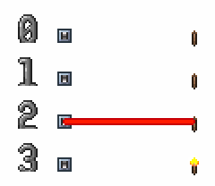

$\textcircled{1}$ 电源（开关）激活 $\rightarrow$ $\textcircled{2}$ 电源上的电线（红色电线）激活 $\rightarrow$ $\textcircled{3}$ 电线下的用电器（火把）激活

:::
#### 2.1.2 电路物品

电源指可以激活其上电线的物块，每个电源有特定的激活条件。逻辑门被称为 **逻辑电源**，除了逻辑门以外的电源被称为 **物理电源**。物理电源可以将非电信号转换为电信号，是逻辑电路的输入端口。只有物理电源可以新建逻辑结算，逻辑电源不能新建逻辑结算。


::: {.admonition .example}


电源包括开关、拉杆、压力板、逻辑感应器等。

:::
用电器指可被其上电线激活的物块，每个用电器有特定的响应方式。逻辑门灯被称为 **逻辑用电器**，除了逻辑门灯以外的用电器被称为 **物理用电器**。物理用电器可以将电信号转换为非电信号，是逻辑电路的输出端口。


::: {.admonition .example}


用电器火把、传送机、传送枪站、机关等。

:::
逻辑电源和逻辑用电器统称逻辑 **电路物品**，物理电源和物理用电器统称 **物理电路物品**。

而只由电线和逻辑电路物品（逻辑门和逻辑门灯）组成的电路被称为 **逻辑电路**。电路是由 **输入端口、逻辑电路、输出端口** 组成的。


::: {.admonition .example}
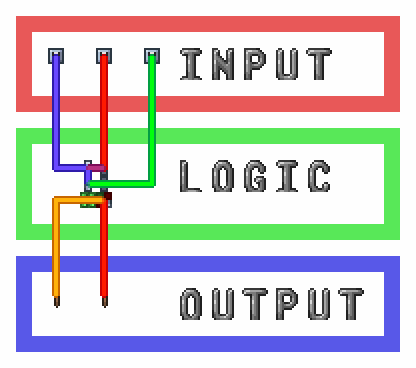

输入端口（开关）、逻辑电路（逻辑门、逻辑门灯、电线）、输出端口（火把）。

:::

::: {.admonition .info}
存在即是电源又是用电器的图格，如计时器。

:::

::: {.admonition .tip}
物理电源和物理用电器的激活条件和响应方式可查阅附录。

:::
##### 多图格电路物品

对于由多个图格组成的电源，并不会因为一根电线连接该电源的多个图格而增加电源激活时该电线的激活次数，电线只连接多图格电源的一个图格和多个图格是一样的。在电源激活时，其上的每根电线都只会被激活一次。


::: {.admonition .example}


左右两种连接方式完全一样，尽管第二种连接了更多图格。

:::

::: {.admonition .tip}
不同颜色的电线或同颜色但中间没有连接的电线不是一根电线，在电源激活时，其上的每根电线都会被激活一次。

:::

::: {.admonition .example}


激活拉杆时，左边的火把会被红线激活一次，点亮；中间的火把会被蓝线激活一次，点亮；右边的火把会被蓝线激活一次，红线激活一次，先点亮后熄灭（过程不可见）。

:::
对于由多个图格组成的用电器，并不会因为一根电线连接该用电器的多个图格而增加该电线激活时该用电器的响应次数，电线只连接多图格用电器的一个图格和多个图格是一样的。在一根电线激活时，其下的用电器只会响应一次。


::: {.admonition .example}


左右两种连接方式完全一样，尽管第二种连接了更多图格。

:::

::: {.admonition .tip}
但不同颜色的电线或同颜色但中间没有连接的电线不是一根电线，在激活用电器时，用电器会分别响应每一根电线上的每一次信号。

:::

::: {.admonition .example}


激活开关时，左边的开关只连接了一种颜色的电线，炮台只旋转一次；右边的开关连接了四种颜色的电线，炮台会旋转四次（过程不可见）。

:::
有些用电器的响应效果会根据激活图格的位置不同而改变。


::: {.admonition .example}


传送枪站、大炮、兔兔炮等多图格用电器会因为激活的图格位置不同而响应不同。

:::
##### 有冷却时间的电路物品

有些用电器的响应会受到冷却时间限制，在冷却时间结束前被激活不会响应。


::: {.admonition .example}


有冷却时间的用电器包括炮台发射、机关、雕像、马桶等。

:::
有冷却时间的用电器被激活并响应后，用电器所在的所有图格坐标与冷却时间（帧）会被加入到所有有冷却时间的电路物品共用的冷却机关列表（多图格用电器的每个格子都会被加入）。

每帧冷却机关列表内的所有图格的冷却时间会减一，在图格冷却时间为零后，冷却时间结束，该坐标会从列表中移除。


::: {.admonition .tip}
有冷却时间的用电器的名字和冷却时间可以在附录查询。

:::
当列表已满或用电器的所有图格都在冷却列表中时（多图格用电器需要所有图格都在列表里），用电器被激活后不会响应。


::: {.admonition .info}
计时器也使用冷却时间列表记录下一次激活的时间，但开启和关闭并不受冷却时间影响。列表满后开启的计时器不会激活。

:::
将正在冷却的用电器挖掉并不会从列表中移除该用电器的图格，但挖掉计时器会将计时器从列表中移除，计时器不会再激活。


::: {.admonition .info}
对于冷却时间相同的项，冷却机关列表是后进先出的，计时器电路中会使用这个性质。

:::
没有冷却时间的用电器可以在一帧内被激活任意次数。


::: {.admonition .example}


无冷却时间的用电器包括逻辑门灯、炮台转向、像素盒、晶莹宝石块、促动器等。

:::
##### 状态表示

有些电源看起来有两个或多个状态，并且每次状态切换会激活其上电线，这种电源被称为 **状态表示电源**，简称 **状态电源**。状态电源在不满足条件到满足条件和满足条件到不满足条件两种情况时都会激活。


::: {.admonition .example}


加重压力板有抬起和按下两种状态，在按下到抬起和抬起到按下时都会激活；普通逻辑门有亮和灭两种状态，在灭切换到亮和亮切换到灭都会激活。

:::

::: {.admonition .example}


加重压力板按下时会激活一次火把，加重压力板抬起时也会激活一次火把。

:::
有些用电器看起来有两个或多个状态，其上电线激活时会在几个状态间切换，这种用电器被称为 **状态表示用电器**，简称 **状态用电器**。状态用电器是有记忆的，它会记住之前的状态，下一次状态变化会在当前状态的基础上变化。

状态电源和状态用电器统称 **状态电路物品**。


::: {.admonition .example}


火把和普通逻辑灯会在激活时由亮切换到灭，或由灭切换到亮，具体是哪种取决于激活前的状态。

:::

::: {.admonition .example}


火把被激活第一次由灭变亮，激活第二次由亮变灭。

:::
对于有两个状态的状态电路物品，我们可以人为设定一个状态为 0（一般指灭或初始态），另一个状态为 1（一般指亮或另一态）。在不激活时，状态电路物品会维持之前的状态不变。


::: {.admonition .info}
也有一些状态电路物品不止两个状态。

:::

::: {.admonition .example}
烟囱有三个状态、彩线灯泡有十六个状态、传送枪台有十八个状态。


:::
我们称只使用状态电路物品和电线的电路为 **状态表示电路**，简称 **状态电路**。状态表示电路的状态可以从电路中直接读出，所有电路物品的状态是同步变化的。


::: {.admonition .example}


如果认为开关向上/火把灭为 0 ，开关向下/火把亮为 1，则开关和火把的状态同步变化，同时为 0 或同时为 1。

:::
##### 激活表示

有些电源看起来只有一个状态，或者看起来有多个状态但是只在一个状态切换到另一个状态时会激活，反过来不会，这种电源被称为 **激活表示电源**，简称 **激活电源**。激活电源只在不满足条件到满足条件时激活，不会在满足条件到不满足条件时激活。


::: {.admonition .example}


如普通压力板尽管看起来有抬起和按下两种状态，但是只会在抬起到按下时会激活，按下到抬起不会激活，所以是激活电源；而故障逻辑门看起来只有一种状态，是激活电源。


:::

::: {.admonition .example}


压力板按下一次时会激活一次火把，压力板按下两次时会激活两次火把。

:::
有些用电器看起来只有一个状态，这种用电器被称为 **激活表示用电器** ，简称 **激活用电器**。激活用电器是没有记忆的，激活时会直接响应而不考虑之前的状态。

激活电源和激活用电器统称 **激活电路物品**。


::: {.admonition .example}


广播盒会在被激活时发出内部文本，传送器会在被激活时传送上方人物与 NPC。

:::

::: {.admonition .example}
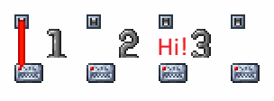

广播盒被激活发送文本。

:::
对于激活电路物品的每个周期，每个激活电路物品都有激活和不激活两种状态，我们可以令激活态/暂态为 1，非激活态/稳态为 0。在不激活时，激活电路物品会恢复并维持不激活态/稳态。


::: {.admonition .tip}
这里的周期指的是电路结算的最小单位，对于逻辑电路来说是逻辑帧。

:::
我们称只使用激活电路物品和电线的电路为 **激活表示电路**，简称 **激活电路**。激活与否并不会改变激活电路物品的状态，所以电路的状态不能从电路中直接读出。


::: {.admonition .example}
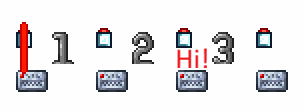

我们看不到激活电路物品的状态，只能通过其它方式间接判断。

:::
如果我们忽略状态电路的状态，那么也可以将状态电路看做激活电路。


::: {.admonition .example}


我们可以忽略开关的状态，把状态电源开关当做激活电源使用。

:::
#### 2.1.3 电线

现实中的数字电路电线会有低电平、高电平、高阻态、未知态等状态，但是泰拉瑞亚中的电线只能传递脉冲信号（激活）一种信号，本身并没有状态或电平。电线下任一电源激活时，电线会激活，并激活其下所有用电器。

电线只是标记电路物品的连接关系（拓扑关系），与颜色、长度和形状无关，没有延迟。电线没有长度和连接电源或用电器数量的限制，连接或不连接电线不会改变电路物品的状态。

电线会将其下电源的状态或变化（激活）无损的传递到其下用电器，在传递过程中不会改变传递的信号，电线没有运算和记忆能力。


::: {.admonition .tip}
电路物品有状态与激活两种，但是电线上传递的信号只有激活信号一种。

:::

::: {.admonition .example}
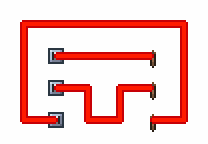

电线只标记电路物品的连接关系，与颜色、长度和形状无关。

:::
共有四种颜色的电线，相同颜色的电线在相邻格子会被连接到一起，组成一根电线；激活电线时，整根电线上的所有格子的电线会一起激活。而不同颜色的电线是在不同的图层上，不会被连接到一起。


::: {.admonition .example}


四色电线

:::

::: {.admonition .example}
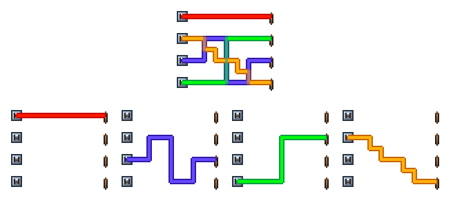

不同颜色电线在不同图层，当同一格有多色电线时，它们的显示颜色会混合，但彼此间互不影响。

:::
使用分线盒或像素盒可以把一个图格内的相同颜色的电线分开。分线盒同时作用于一个图格中所有颜色的电线。一共有三种分线盒，分别把来自上下和左右、上左和下右、上右和下左的同色电线分开。像素盒只能将来自上下和左右的同色电线分开。


::: {.admonition .example}


开关分别能控制：全部火把、下方火把、左侧火把、右侧火把、下方火把。

:::
##### 最简电路

本章第一节提到电路是由物理输入端口、逻辑电路、物理输出端口组成的，而逻辑电路是由逻辑电源（逻辑输入端口）、逻辑用电器（逻辑输出端口）、电线组成的。所以我们可以得到电路的最简形式：一根电线与其下所有的电路物品。这样的电路被称为 **最简形式电路**，简称 **最简电路**，任何电路都是由这样的一个或多个最简电路组成。


::: {.admonition .example}
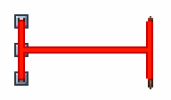

最简电路，由一根红色电线（电线）、三个开关（电源）、三个火把（用电器）组成。

:::
由于大部分电路同时包括状态表示和激活表示，所以对于电路状态表示和激活表示的讨论通常对最简电路进行。当最简电路中只有状态电路物品和电线时，被称为 **最简状态电路**；当最简电路中只有激活电路物品和电线时，被称为 **最简激活电路**。

最简状态电路中的电线会在其下任一状态电源状态发生变化时令其下全部状态用电器状态发生变化；最简激活电路中的电线会在其下任一激活电源激活（进入激活态）时令其下全部激活用电器激活（进入激活态）。


::: {.admonition .example}


最简状态电路和最简激活电路。

:::
当最简电路的电源中存在激活电源，用电器中存在状态用电器，则该最简电路存在激活转状态；当最简电路的电源中存在状态电源，用电器中存在激活用电器，则该最简电路存在状态转激活。


::: {.admonition .example}


激活转状态和状态转激活。

:::

::: {.admonition .example}
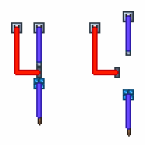

我们可以将复杂的电路拆分成最简形式，然后逐条电线的分析。

:::
##### 参考状态

尽管电线是没有状态的，但是有时为了便于讨论，我们会假设电线有状态，这种状态被称为 **参考状态**。最简状态电路中的电线被称为 **状态传递电线**，简称 **状态电线**；最简激活电路中的电线被称为 **激活传递电线**，简称 **激活电线**。当最简电路中同时存在激活和状态表示时，我们根据更加关注的是状态还是激活来选择电线的类型，通常由用电器的类型决定，忽略电源的类型。后文会用将状态电线的参考状态简称为 **电线的状态**。一般设定电线的初态/稳态为 0；另一态/暂态为 1。

##### 线非

对于最简状态电路，电源和用电器的状态是同步变化的。但是由于电源和用电器的状态是可以人为设定的，如果我们设定一对电源和用电器的状态相反，将电源状态看做输入，将用电器看做输出，我们就会得到一个输入与输出始终相反的电路，也就是非逻辑。


::: {.admonition .example}
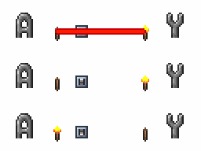

设定左侧火把与开关状态相同，则可以用火把代替开关状态。使用电线连接输入（状态电源开关）与输出（状态用电器火把），输入和输出状态始终相反，存在非逻辑。

$$y = \lnot a$$

:::
像这样不使用逻辑门，只使用一个任意状态电源、一个任意状态用电器和一根电线实现的非逻辑被称为 **线非**。由于线非的存在，我们可以在任意状态用电器处实现对输入的取反，而不需要使用逻辑门。

##### 线异或

异或逻辑又被叫做可控非逻辑，因为当一个输入为 0 时，输出与另一个输入相等；当一个输入为 1 时，输出为另一个输入的反相。考虑最简状态电路中的两个电源和一个用电器，将电源状态看做输入，将用电器看做输出，当一个输入为 0 时，输出与另一个输入相等；当一个输入为 1 时，输出为另一个输入的反相；满足异或逻辑。


::: {.admonition .example}
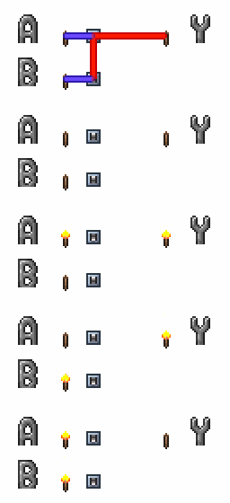

使用电线连接输入（两个状态电源开关）与输出（状态用电器火把）满足异或逻辑。

$$y = a \oplus b$$

:::
由于异或具有交换率，交换两个输入对输出没有影响，所以输出与两个输入的顺序无关，具有普适性。同理，异或具有结合律，所以即便有多个输入，输出仍然满足所有输入间异或，可以任意扩展。


::: {.admonition .example}
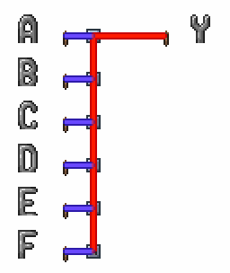

$$y = a \oplus b \oplus c \oplus d \oplus e \oplus f$$

:::
像这样不使用逻辑门，只使用多个状态电源和一个状态用电器实现异或逻辑的方式被称为 **线异或**。由于线异或的存在，我们可以在任意状态用电器处实现异或，而不需要使用逻辑门。


::: {.admonition .tip}
线非是线异或只有一个输入的特殊情况。

:::
线异或的输入是状态用电器上所有电线连接的所有电源状态和状态用电器自身状态，输出是状态用电器状态，输入和输出间满足异或关系。


::: {.admonition .info}
电线在线异或中只标记连接关系，并不参与运算，线异或的输入是电源和用电器自身状态，输入电源在一个或多个电线上不会影响结果，输出与输入连接到输入的方式无关。


:::: {.admonition .tip}
一个电源通过不同电线连接到用电器算多次连接；一个多图格电源的多个图格通过一条电线连接到用电器算一次连接。

::::

:::: {.admonition .example}
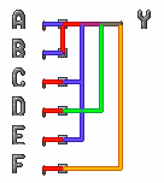

$$y = a \oplus b \oplus c \oplus d \oplus e \oplus f$$

::::
:::

::: {.admonition .tip}
注意区分线异或的异或和异或门的独热逻辑在输入数量大于等于 3 时是不同的。

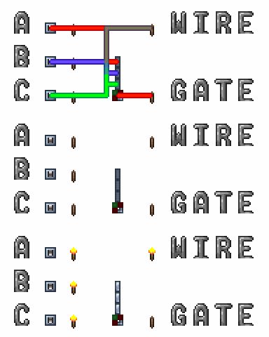

:::

::: {.admonition .tip}
线异或是泰拉瑞亚电路中最常用的运算。

:::
##### 线或

或逻辑中，当任意输入为 1 时，输出为 1；只有全部输入都为 0 时，输出为 0。考虑最简激活电路中的多个电源和一个用电器，任意电源激活时，用电器会被激活；没有电源激活时，用电器不会被激活；满足或逻辑。


::: {.admonition .example}
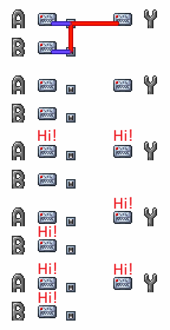

使用电线连接输入（两个激活电源开关）与输出（激活用电器广播盒）满足或逻辑。

$$y = a \lor b$$

:::
像这样不使用逻辑门，只使用多个激活电源和一个激活用电器实现或逻辑的方式被称为 **线或**。由于线或的存在，我们可以在任意激活用电器处实现或，而不需要使用逻辑门。

线或的输入是激活用电器上所有电线连接的所有电源状态，输出是激活用电器状态，输入和输出间满足或关系。


::: {.admonition .info}
电线在线或中只标记连接关系，并不参与运算，线或的输入是电源状态，输入电源在一个或多个电线上不会影响结果，输出与输入连接到输入的方式无关。


:::: {.admonition .example}
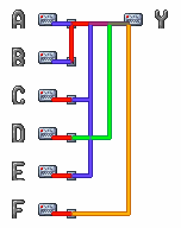

$$y = a \lor b \lor c \lor d \lor e \lor f$$

::::
:::

::: {.admonition .tip}
多输入或与两两或等价，所以线或与多输入或门等价。

:::

::: {.admonition .example}
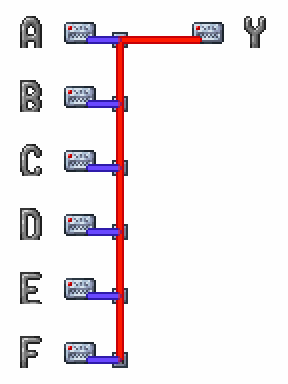

$$y = a \lor b \lor c \lor d \lor e \lor f$$

:::

::: {.admonition .tip}
然而对于没有冷却时间的物理激活用电器（如广播盒），被激活一次就会响应一次，即便是同时激活多次，每一次都会单独响应，并不是严格的线或逻辑。

严格的线或逻辑只存在于逻辑电路（故障灯），通常用于检测多位信号中是否存在或全为 0 / 1，用来代替较大的多输入或门，较线异或应用较少。

:::

::: {.admonition .tip}
线非、线异或、线或揭示了一个用电器通过一条或多条电线连接到多个电源时，用电器本身状态和多个连接电源状态间的关系。

:::
### 2.2 逻辑门

#### 2.2.1 逻辑门灯和逻辑门

泰拉瑞亚中的逻辑门由逻辑门和逻辑门灯组成，逻辑门灯可以被堆叠于逻辑门上。逻辑门上的逻辑门灯指其上方中间不相隔任何非逻辑灯图格的全部逻辑门灯。


::: {.admonition .example}


逻辑灯堆叠于逻辑门上。

:::
##### 逻辑门灯

逻辑门灯有三种，分别是 **逻辑门灯（亮）、逻辑门灯（灭）、逻辑门灯（故障）** 。其中逻辑门灯（亮）和逻辑门灯（灭）被称为 **普通逻辑门灯**，简称 **普通灯**；逻辑门灯（故障）被称为 **故障逻辑门灯**，简称 **故障灯**。


::: {.admonition .quote}


逻辑门灯（亮）、逻辑门灯（灭）、逻辑门灯（故障）。

:::
逻辑灯是用电器，输入是其上所有电线连接的所有电源状态和自身状态，输出是自身状态。

普通灯是状态用电器，有记忆，输入包括自身状态，输入满足线非和线异或逻辑；故障灯是激活用电器，无记忆，输入不包括自身状态，输入满足线或逻辑。


::: {.admonition .tip}
记忆指的是能记住之前状态的能力，故障灯只有在被激活的逻辑帧是激活态，下一个逻辑帧如果没有被激活就会恢复不激活态；普通灯不被激活时始终维持之前的状态不变。

:::
逻辑灯必须堆叠在逻辑门上，我们说这些逻辑灯在该逻辑门上，该逻辑门在这些逻辑灯下。


::: {.admonition .quote}
设一个逻辑灯有 $m$ 个电源输入，电源的状态分别是 $s_1, s_2, \cdots, s_m$，则： 

普通灯（灭）的逻辑式：

$$\mathrm{OffLamp}(s_1, s_2, \cdots,s_m) = s_1 \oplus s_2 \oplus \cdots \oplus s_m$$

普通灯（亮）的逻辑式：

$$\mathrm{OnLamp}(s_1, s_2, \cdots,s_m) = \lnot (s_1 \oplus s_2 \oplus \cdots \oplus s_m)$$

或者可写为：

$$\mathrm{OnLamp}(s_1, s_2, \cdots,s_m) = s_1 \oplus s_2 \oplus \cdots \oplus s_m \oplus 1$$

普通灯的逻辑通式：

$$\mathrm{Lamp}(s_1, s_2, \cdots,s_m; l_0) = s_1 \oplus s_2 \oplus \cdots \oplus s_m \oplus l_0$$

$l_0$ 是逻辑灯状态，灭灯为 0，亮灯为 1。


:::: {.admonition .tip}
应用异或的可控非逻辑定义。

::::
故障灯的逻辑式：

$$\mathrm{FaultLamp}(s_1, s_2, \cdots, s_m) = s_1 \lor s_2 \lor \cdots \lor s_m$$

:::

::: {.admonition .example}


这些紧密排列的逻辑门中，相同颜色的区域是同一个逻辑门。

:::
##### 逻辑门

当逻辑门上没有故障灯时，逻辑门被称为 **普通逻辑门**，简称 **普通门**；当逻辑门上有故障灯时，逻辑门变成蓝色，被称为 **故障逻辑门**，简称 **故障门**。


::: {.admonition .quote}


普通逻辑门（亮）、普通逻辑门（灭）、普通逻辑门（故障）。

:::
逻辑门是电源，输入是其上逻辑灯状态，输出是逻辑门自身状态。

普通门是状态电源，状态取决于其上普通灯状态；故障门是激活电源，激活取决于其上普通灯和故障灯状态，并且只有可能在其上故障灯激活时激活。逻辑门的状态只取决于其上逻辑灯状态，与自身状态无关。

一个逻辑灯只对应一个逻辑门，而一个逻辑门可以对应任意多个逻辑灯。

##### 全逻辑门

由逻辑门和其上逻辑灯组成的整体被称为 **全逻辑门**。全逻辑门的输入是全部逻辑灯的全部输入，既：全部逻辑灯上全部电线连接的全部电源状态和其上普通灯自身状态；全逻辑门的输出是逻辑门的的输出，既：逻辑门的状态。

全逻辑门的逻辑式是将每个逻辑灯关于输入电源的逻辑式对应带入逻辑门关于输入逻辑灯的逻辑式，得到逻辑门关于输入电源的逻辑式。

#### 2.2.2 普通逻辑门

普通门有 **与、与非、或、或非、异或、同或** 六种。普通门有亮和灭两种状态，由其上普通灯状态决定。普通灯是输入，普通门是输出，亮灯/门是 1，灭灯/门是 0，除异或门和同或门外，输入与输出的关系与上一章所述同名逻辑运算相同，异或门和同或门的逻辑是独热和独热非。


::: {.admonition .quote}
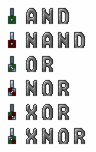

与、与非、或、或非、异或、同或六种普通门。

:::

::: {.admonition .example}
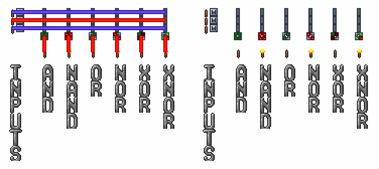

六种三输入普通逻辑门。

:::
##### 逻辑等价的普通门


::: {.admonition .quote}


等价前的普通门。

:::
由于线非的存在，我们可以直接令输入电源普通门的状态和输出状态用电器的状态相反，令与门和与非门、或门和或非门、异或门和同或门等价。


::: {.admonition .quote}


利用线非令与门和与非门、或门和或非门、异或门和同或门等价。

:::
上一章已经证明过或逻辑可以通过取反输入和输出与与逻辑等价，表述如下：

$$\lnot(a \land b) = \lnot a \lor \lnot b$$

$$\lnot(a \lor b) = \lnot a \land \lnot b$$


::: {.admonition .tip}
对于三项及三项以上仍然是成立的，可自行证明。

:::
将或门的逻辑表达式进行两次取反，然后可将或逻辑转换为与逻辑：

$$y = a \lor b = \lnot \lnot (a \lor b) = \lnot (\lnot a \land \lnot b)$$

将与门的逻辑表达式进行两次取反，然后可将与逻辑转换为或逻辑：

$$y = a \land b = \lnot \lnot (a \land b) = \lnot (\lnot a \lor \lnot b)$$

由此我们可以直接令输入状态电源的状态与输出用电器普通灯的状态相反，令与门和或非门、或门和与非门等价，然后再利用前述结论，可令与门和或门等价。


::: {.admonition .quote}


利用前述结论令与门和或非门、或门和与非门等价，再利用线非令与门和或门、与非门和或非门等价。

:::

::: {.admonition .question}
那么我们是否能将与门和异或门等价呢？

不可能，原因会在下一章介绍。

:::
这样我们就可以将六种普通门等价为与门和异或门两种普通门，与门在其上所有普通灯点亮时点亮，异或门在其上只有一个普通灯点亮时点亮。在任何电路中，都可以只使用这两种普通门实现全部逻辑，而不需要其它普通门。


::: {.admonition .example}


对于所有可能的输入，左侧四种逻辑门、右侧两种逻辑门的输出一致，证明其等价。

:::
##### 普通灯的性质

普通灯是状态用电器，普通灯切换状态时，下方普通门会根据上方所有普通灯状态决定自己状态；而普通灯同时切换多次状态，下方普通门只会考虑普通灯的最后状态（即线异或），而不考虑中间状态。普通门是状态电源，在由亮到灭和由灭到亮切换状态时都会激活其上电线。


::: {.admonition .example}
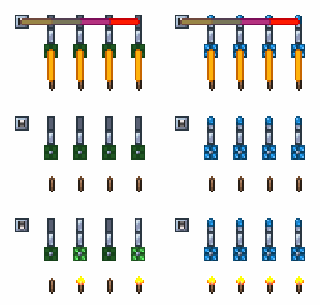

左侧普通灯激活一次和三次时，线异或结果是 1，输出 1；激活二次和四次时，线异或结果是 0，输出 0；
右侧故障灯激活大于等于一次时，线或结果都是 1，输出 1。

:::

::: {.admonition .quote}
设一个普通门有 $n$ 个普通灯输入，普通灯的状态分别是 $l_1, l_2, \dots, l_m$，则： 

与门的逻辑通式：

$$\mathrm{AndGate}(l_1, l_2,\dots,l_m) = l_1 \land l_2 \land \cdots \land l_n$$

异或门的逻辑通式：

$$\mathrm{XorGate}(l_1, l_2,\dots,l_m) = \mathrm{onehot}(l_1, l_2, \cdots, l_n)$$

:::

::: {.admonition .quote}
设普通门上第 $j$ 个普通灯表达式如下：

$$l_j = \mathrm{Lamp}(s_{j1},\dots,s_{jk_j};l_{0j})$$

全与门逻辑式如下：

$$\mathrm{FullAndGate}\Big(\{s_{ji}\}_{\substack{1\le j\le n\\1\le i\le k_j}}; \{l_{0j}\}_{j=1}^{n}\Big) \\ = \\ (s_{11} \oplus \cdots \oplus s_{1k_1} \oplus l_{01}) \land \cdots \land (s_{j1} \oplus \cdots \oplus s_{jk_j} \oplus l_{0j})$$

全异或门逻辑式如下：

$$\mathrm{FullXorGate}\Big(\{s_{ji}\}_{\substack{1\le j\le n\\1\le i\le k_j}}; \{l_{0j}\}_{j=1}^{n}\Big) \\ = \\ \mathrm{OneHot}(s_{11} \oplus \cdots \oplus s_{1k_1} \oplus l_{01}, \cdots, s_{j1} \oplus \cdots \oplus s_{jk_j} \oplus l_{0j})$$


:::: {.admonition .tip}
将普通门逻辑式中的全部 $l_j$ 用对应普通灯逻辑式代替

::::
:::

::: {.admonition .tip}
代入法是一种常见的代数运算方法。当某个逻辑量已知等价于一个由其他变量构成的代数式时，可以在任意逻辑式中用该表达式直接替换原变量，而不改变逻辑结果。

逻辑灯的输入是其上全部电线连接的全部电源状态和其本身状态，输出是逻辑灯状态；逻辑门输入是其上全部逻辑灯状态，输出是逻辑门状态。

全逻辑门是由逻辑门和其上逻辑灯组成的，所以将逻辑灯的代数式代入逻辑门的代数式就可以得到全逻辑门的代数式，输入是逻辑门上逻辑灯上全部电线连接的全部电源状态和逻辑灯状态，输出是逻辑门状态。

:::

::: {.admonition .example}

:::: {.admonition .question}
写出下列全与门的逻辑式：


::::
* $y_1 = \lnot (a \oplus b) \land (a \oplus b \oplus c) \land a$

* $y_2 = \lnot ((a \oplus c) \land \lnot (a \oplus b \oplus c) \land c)$

* $y_3 = \lnot (\lnot b \land \lnot (a \oplus b \oplus c) \land \lnot c)$

* $y_4 = b \land (a \oplus b \oplus c) \land \lnot a$

使用 $\oplus 1$ 代替非逻辑：

* $y_1 = (a \oplus b \oplus 1) \land (a \oplus b \oplus c) \land a$

* $y_2 = (a \oplus c) \land (a \oplus b \oplus c \oplus 1) \land c \oplus 1$

* $y_3 = (b \oplus 1) \land (a \oplus b \oplus c \oplus 1) \land (c \oplus 1) \oplus 1$

* $y_4 = b \land (a \oplus b \oplus c) \land (a \oplus 1)$

:::
#### 2.2.3 故障逻辑门

当在普通门上堆叠故障灯时，普通门会变成蓝色的故障门，所有故障门逻辑都是一样的，尽管它们看起来不同。


::: {.admonition .quote}


故障逻辑门，尽管贴图不同，但是逻辑相同。

:::
故障门与其上最靠下的故障灯之间的普通灯称为 **有效逻辑灯**，简称 **有效灯**。当故障逻辑门上有任意一个故障逻辑灯被激活时，故障门会按照有效灯中亮灯的数量比有效灯总数为概率激活。


::: {.admonition .example}
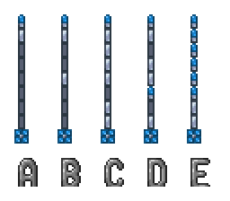

当激活图中五个故障门的故障灯时，故障门激活的概率分别是：

A: $ 1 \over 7$; B: $2 \over 7$; C: $6 \over 7$; D: $1 \over 2$; E: $1$;

:::
<div style="display: flex; align-items: center; margin-bottom: 0;">
  
  <div style="margin-left: 10px;">
    其他故障灯（激活效果与最下方故障灯相同）
  </div>
</div>
<div style="display: flex; align-items: center; margin-bottom: 0;">
  
  <div style="margin-left: 10px;">
    其他普通灯（不影响概率）
  </div>
</div>
<div style="display: flex; align-items: center; margin-bottom: 0;">
  
  <div style="margin-left: 10px;">
    
  </div>
</div>
<div style="display: flex; align-items: center; margin-bottom: 0;">
  
  <div style="margin-left: 10px;">
    
  </div>
</div>
<div style="display: flex; align-items: center; margin-bottom: 0;">
  
  <div style="margin-left: 10px;">
    
  </div>
</div>
<div style="display: flex; align-items: center; margin-bottom: 0;">
  
  <div style="margin-left: 10px;">
    最下方故障灯（下方为有效灯）
  </div>
</div>
<div style="display: flex; align-items: center; margin-bottom: 0;">
  
  <div style="margin-left: 10px;">
    有效灯（激活故障灯时故障门激活概率为有效亮灯比全部有效灯）
  </div>
</div>
<div style="display: flex; align-items: center; margin-bottom: 0;">
  
  <div style="margin-left: 10px;">
    
  </div>
</div>
<div style="display: flex; align-items: center; margin-bottom: 0;">
  
  <div style="margin-left: 10px;">
    故障门
  </div>
</div>
</br>


::: {.admonition .tip}
由于故障门是概率激活的，所以又被叫做随机门。

:::
故障门上的故障灯为激活用电器，而普通灯为状态用电器。改变普通灯的状态不会使故障门激活，而激活故障灯有可能会使故障门激活。一个故障逻辑门上的所有故障灯都是相同的，而除有效灯以外的普通灯的状态不会影响故障逻辑门的概率，除有效灯以外的普通灯可以看做不存在。故障灯每次激活时，故障门都有概率激活；而故障灯同时被激活多次，下方故障门只会尝试判断激活一次（即严格线或）。故障门是激活电源，在成功激活时会激活其上电线。

### 2.3 逻辑结算

#### 2.3.1 逻辑结算

##### 帧结算

泰拉瑞亚中每一帧中，除电路外所有的游戏机制会依一定顺序结算，电路结算的位置和触发电路的物理电源结算位置有关。也就是说，当实体触发电路时，会在实体所在结算，触发电路的位置，插入一个电路结算，插入的电路结算被称为 **逻辑结算**。


::: {.admonition .example}
由某人物触发的压力板，会在该人物结算的压力板结算位置处，触发一个逻辑结算；由某射弹触发的垫板，会在该射弹结算的垫板结算位置处，触发一个逻辑结算。

:::

::: {.admonition .info}
有些电路会受物理电源的类型影响，例如计时器作为物理电源时，不会直接激活自己，但可以用逻辑门绕开；逻辑感应器（玩家）作为物理电源时无法触发传送机，需要更换电源类型；加重压力板作为物理电源时，触发传送机会导致传送否定等等，详细内容会在后文介绍。

:::
##### 逻辑结算

当一个物理电源激活一次时，会新建一个逻辑结算，逻辑电源无法新建逻辑结算。

每帧内逻辑结算的数量没有限制，在逻辑结算结算完成前，后续的代码不会运行。无论逻辑结算的规模有多大，有多少逻辑门和多少电线，都会在一帧内完成。可以说泰拉瑞亚电路是没有频率上限且没有延迟的。


::: {.admonition .tip}
实际上频率会受限于能制作出来的驱动/时钟频率；延迟会受限于电脑性能，当计算量较大时，帧结算需要的时间会增加，物理帧会降低。

:::
在泰拉瑞亚中，逻辑结算被叫做时钟周期，简称 **周期**；而接近现实电路周期概念的电路结算最小单位被叫做逻辑帧，后文将使用上述叫法。能在一个周期内完成计算的电路被称为 **单周期电路**，需要多个周期才能完成计算的电路被称为 **多周期电路**。

##### 逻辑帧结算

对于逻辑门电路，逻辑结算被分步进行，每一步中都进行 **电源（逻辑门）激活判断 $\rightarrow$ 电源（逻辑门）激活 $\rightarrow$ 电线激活 $\rightarrow$ 用电器（逻辑灯）激活** 四小步，我们将这样的四步统称为 **逻辑帧**。一个逻辑电路的结算过程中，反复运行每个逻辑帧中的四小步，直到没有逻辑门需要激活。


::: {.admonition .example}
考虑这样的电路：


激活开关后：

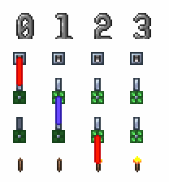

第 0 逻辑帧：开关激活 $\rightarrow$ 电线激活 $\rightarrow$ 逻辑灯激活；
第 1 逻辑帧：逻辑门判断 $\rightarrow$ 逻辑门激活 $\rightarrow$ 电线激活 $\rightarrow$ 逻辑灯激活；
第 2 逻辑帧： 逻辑门判断 $\rightarrow$ 逻辑门激活 $\rightarrow$ 电线激活 $\rightarrow$ 火把激活；

:::
在逻辑灯状态改变后，并不会马上进行逻辑灯下逻辑门是否激活的判断，而是在下一逻辑帧再进行激活判断。所以某一逻辑帧逻辑门是否激活只需要考虑逻辑门上逻辑灯在上一逻辑帧的终态，不需要考虑中间态（普通灯考虑亮灭，故障灯考虑被激活）。


::: {.admonition .example}
考虑这样的电路：


激活开关后：

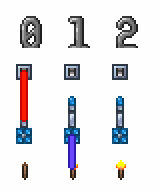

第 0 逻辑帧：开关激活 $\rightarrow$ 电线激活 $\rightarrow$ 逻辑灯激活：普通灯由灭到亮，故障灯由稳态到激活态；
第 1 逻辑帧：逻辑门判断：故障灯激活态，普通灯亮，故障门应激活 $\rightarrow$ 逻辑门激活 $\rightarrow$ 电线激活 $\rightarrow$ 火把激活；

:::

::: {.admonition .example}
考虑这样的电路：


激活开关后：

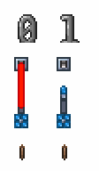

第 0 逻辑帧：开关激活 $\rightarrow$ 电线激活 $\rightarrow$ 逻辑灯激活：普通灯由亮到灭，故障灯由稳态到激活态；
第 1 逻辑帧：逻辑门判断：故障灯激活态，普通灯灭，故障门不应激活；

:::
逻辑帧是逻辑门电路的最小时间单位，逻辑帧内的事情是同时发生的，所以我们会以逻辑帧为单位分析逻辑门电路。两个相邻逻辑帧间相隔一个逻辑门，令物理电源所在逻辑帧为 **第 0 逻辑帧**，每经过一个逻辑门逻辑帧加一，可以通过数出一个信号从物理电源传递到某个逻辑门时经过的逻辑门数量，来计算该逻辑门在此逻辑结算所在逻辑帧位置。当需要分析一个信号到达两个逻辑门时相差多少逻辑帧时，我们可以上溯到它们最近的公共逻辑帧。在逻辑电路中的延迟指的是逻辑帧延迟，表示信号的先后逻辑帧差，同逻辑结算中没有时间差。


::: {.admonition .example}
考虑这样的电路：

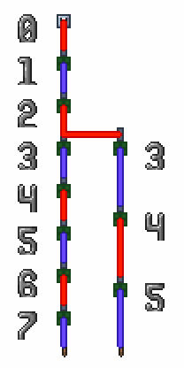

激活开关后：

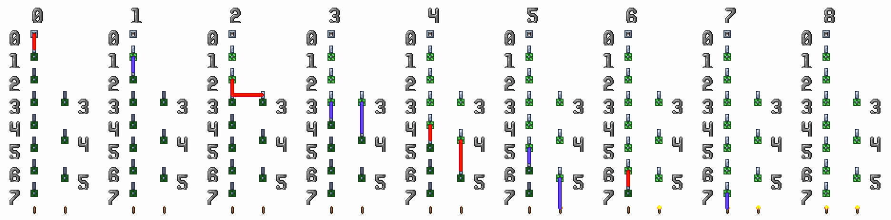

:::

::: {.admonition .example}
考虑这样的电路：

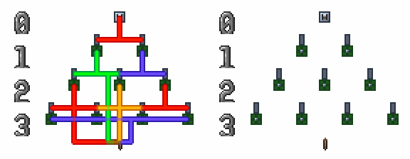

激活开关后：

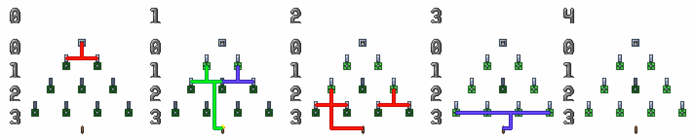

:::
##### 电源结算

每个逻辑帧中，电线会先后激活一些逻辑灯，而这些逻辑灯下的逻辑门可能会在下一逻辑帧被激活。逻辑门激活的顺序取决于其上逻辑灯在上一逻辑帧被激活的顺序，先激活的逻辑灯下的逻辑门先激活，后激活的逻辑灯下的逻辑门后激活。


::: {.admonition .example}
考虑这样的电路：


激活开关后：


第 0 逻辑帧：左边的逻辑灯先被激活，右边的逻辑灯后被激活；
第 1 逻辑帧：左边的逻辑门先激活，右边的逻辑门后激活。

:::
##### 电线结算

每个电源上的每个格子，会按照 **先从左到右，再从上到下** 激活每个格子里的电线。每个格子的四色电线中，会按照 **红 $\rightarrow$ 蓝 $\rightarrow$ 绿 $\rightarrow$ 黄** 的颜色顺序依次进行结算。


::: {.admonition .example}
考虑这样的电路：


激活开关后：

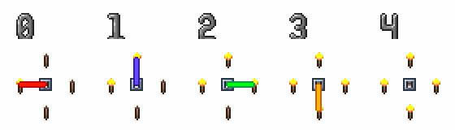

电源上每一格的电线会按照 红 $\rightarrow$ 蓝 $\rightarrow$ 绿 $\rightarrow$ 黄 的顺序结算。

:::

::: {.admonition .example}
考虑这样的电路：


激活开关后：

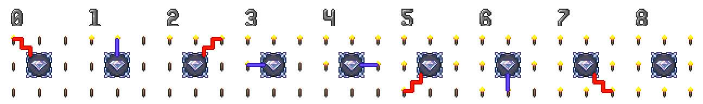

电源的每一格会按照先从左到右，再从上到下的顺序结算其上电线。

:::
##### 格子结算

每根电线进行结算时，会从电源开始，使用四连通广度优先搜索（BFS）来遍历该电线上连接的所有图格，添加到队列的顺序是 **下 $\rightarrow$ 上 $\rightarrow$ 右 $\rightarrow$ 左** 。

一般情况下，我们只需要知道，电线上各个格子按照沿电线上距离电源的传播距离由近到远的顺序激活。


::: {.admonition .example}
考虑这样的电路：


激活开关后：


电线的每一格会按照从电源出发，沿着电线逐格结算。

:::
##### 结算层级

综上，电路结算具有严格的层级结构，其整体顺序为：

**帧结算 > 逻辑结算 > 逻辑帧结算 > 电源结算 > 电线结算 > 格子结算**

上层结算由多个下层结算组成，并通过逐层拆分完成：只有当前层级包含的所有下层结算全部完成后，才会继续执行当前层级的后续流程。


::: {.admonition .tip}
实际应用中，我们常用工具（[电路步进模组 MechScope](https://steamcommunity.com/sharedfiles/filedetails/?id=3232991031)）来观察电路结算顺序，大型时序电路在不使用工具的情况下很难进行测试。

:::
#### 2.3.2 爆门


::: {.admonition .question}
泰拉电路没有延迟，逻辑结算不完成程序不会继续执行，那么激活这样的电路会发生什么？


:::: {.admonition .failure}
开关激活 $\rightarrow$ 电线激活 $\rightarrow$ 逻辑灯激活 $\rightarrow$ 逻辑门激活 $\rightarrow$ 电线激活 $\rightarrow$ 逻辑灯激活 $\rightarrow$ 逻辑门激活 $\rightarrow$ ……

::::
这会陷入死循环，卡死游戏吗？然而实际尝试后我们会发现逻辑门冒烟了，但是游戏并没有卡死，这是怎么回事呢？


:::
泰拉为了防止无延迟的电路出现死循环卡死游戏，为逻辑门添加了一个设定：同一个逻辑门在一次逻辑结算中只能激活一次。如果尝试激活第二次，逻辑门的状态会正常切换，但是不会激活其上电线，并且会有白烟从逻辑门中冒出，这种现象被称为 **爆门**。


::: {.admonition .tip}
上方的示例电路中红线会激活两次，第一次电源是开关，第二次电源是逻辑门，而逻辑门只会激活一次。

:::
实际上，使用爆门来防止死循环，也会产生一些副作用，有些不会死循环的电路也会发生爆门。在实际应用中，爆门经常导致电路出问题，这是因为我们往往希望逻辑门在不同逻辑帧多次状态切换时可以多次激活，但实际上不会。学会了预测爆门，就可以想办法避免爆门，甚至利用爆门。


::: {.admonition .example}
考虑这样的电路：

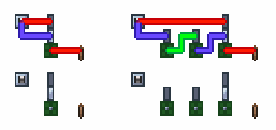

左右逻辑一样，区别是左侧两个信号没有延迟同时到达；右侧的下方信号会延迟两个逻辑帧到达。

激活开关后：

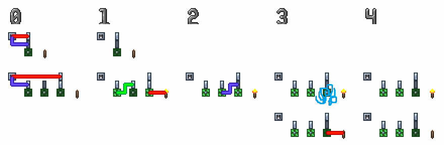

第一行是左侧电路激活后情况，火把不会点亮；
第二行是右侧电路激活后情况，上方信号先激活逻辑门点亮火把，下方信号第二次激活逻辑门失败，触发爆门，逻辑门没有发出信号；逻辑门状态改变但火把状态未改变，逻辑门和火把状态不一致；
第三行是假设没有爆门时右侧电路激活后情况，上方信号先激活逻辑门点亮火把，下方信号第二次激活逻辑门熄灭火把，与左侧电路结果一致。

:::
##### 竞争和冒险

输入信号通过两条或以上路径到达同一个逻辑门时，由于两条路径上的延迟（逻辑帧）不同，出现了到达先后时间差，被称为 **竞争**；由于竞争的存在，先到达的信号激活逻辑门后，后到达的信号再想激活逻辑门会导致逻辑门爆门，出现错误，被称为 **冒险**。

我们通常使用两个方法来避免爆门：

- 给先到达的信号添加逻辑延迟，让两个信号同时到达同一个逻辑门；

- 使用寄存器暂存信号，需要时再将它们同时发送给同一个逻辑门；


::: {.admonition .example}


给先到达的信号（上方信号）添加逻辑延迟，让两个信号同时到达逻辑门。

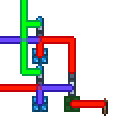

使用寄存器暂存信号，需要时再将它们同时发送给逻辑门。

:::
### 2.4 逻辑电路

#### 2.4.1 组合逻辑与时序逻辑

逻辑电路中，所有电线全部为状态电线的电路被称为 **组合逻辑电路**；有至少一根电线为激活电线的电路称为 **时序逻辑电路**。

组合逻辑电路中只有与门和异或门，并且每根电线只在某个固定的逻辑帧激活，每个输出对应一个逻辑函数。时序逻辑电路中同一根电线可能在不同逻辑帧激活，并且不同逻辑帧激活可能表示不同信号。


::: {.admonition .example}
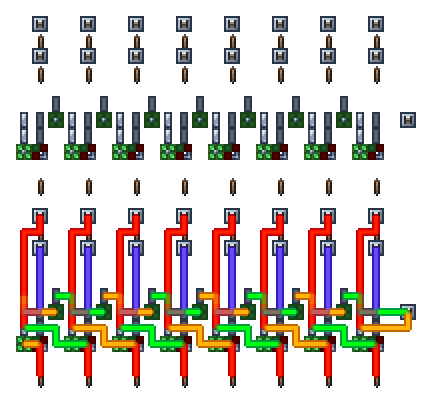

组合逻辑加法器，所有电线都是状态表示。

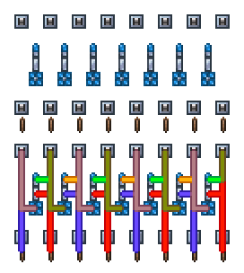

时序逻辑加法器（累加器），部分电线是状态表示，部分电线是激活表示。

:::

::: {.admonition .info}
与现实数电不同，泰拉的普通灯有记忆，触发器可只由一个逻辑门实现，时序逻辑电路相较组合逻辑电路不会有更大的面积和更多的延迟。

组合逻辑电路中每一个数据需要独立的逻辑延迟，这会占用大量的面积；而时序逻辑电路中可以让所有数据使用共享的逻辑延迟，只需要一个公共逻辑延迟链。

组合逻辑电路的状态可以直接在电路中读出；但时序逻辑电路不能，通常需要借助工具进行调试。

通常在泰拉电路中，绝大部分是时序逻辑电路；组合逻辑电路仅占其中的很小一部分。

:::
#### 2.4.2 最简逻辑电路

我们将一个逻辑门、该逻辑门上所有逻辑灯、连接该逻辑门与其上逻辑灯的所有电线组成的逻辑电路称为 **最简逻辑电路**。类似最简电路，任何逻辑电路也是由一个或多个最简逻辑电路组成。


::: {.admonition .example}
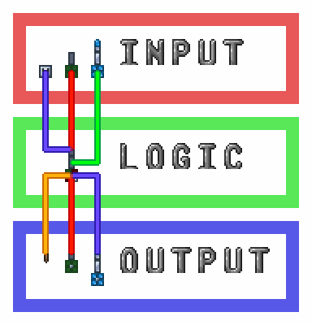

最简逻辑电路，由一个异或门（逻辑门）、其上普通灯（逻辑灯）、连接该逻辑门与其上逻辑灯的所有电线（电线）组成。

最简逻辑电路不包括除最简逻辑电路的逻辑门外的电源、除最简逻辑电路的逻辑灯外的用电器。

:::
当最简逻辑电路的逻辑门是普通门时，被称为 **最简状态逻辑电路**，或 **最简组合逻辑电路**；当最简逻辑电路的逻辑门是故障门时，被称为 **最简激活逻辑电路**，或 **最简时序逻辑电路**。


::: {.admonition .example}
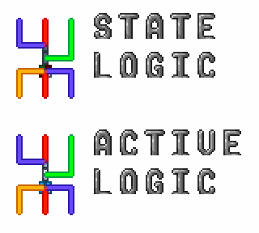

最简状态（组合）电路和最简激活（时序）电路。

:::

::: {.admonition .info}
最简逻辑电路又被称为 **电路元件**。

:::
#### 2.4.3 电路模块

##### 模块化

模块化是简化逻辑电路分析的有效方法，对于任意电路需求，我们都可以将其拆分成多个较简单的步骤，然后再将每个步骤继续拆分成更简单的步骤，直到将电路需求拆分到每一个步骤都可由最简逻辑电路实现的最简步骤；再使用最简逻辑电路实现最简步骤，使用多个最简步骤实现较复杂的步骤，然后再使用多个步骤实现更复杂的步骤，直到完整实现电路需求。


::: {.admonition .example}
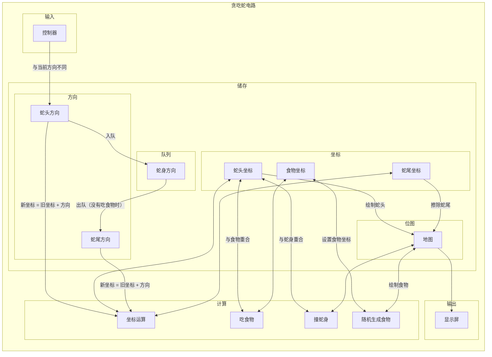
贪吃蛇电路的流程图，逻辑电路可以被分为 **输入、输出、储存、计算、控制（在箭头上体现）** 五部分。

:::
上述的每一个步骤，都对应逻辑电路的构成部分。电路元件是逻辑电路的最基础构成部分，由单个逻辑门构成；多个电路元件可以构成更大的逻辑电路部分，被称为 **电路部件**，由多个逻辑门构成；而多个电路部件可以构成更大的逻辑电路部分，被称为 **电路模块**，电路模块也可以构成更大的电路模块；逻辑电路通常由多个电路模块构成。


::: {.admonition .tip}
对于逻辑电路和步骤的划分，可根据需要任意进行。

:::

::: {.admonition .example}

:::: {.admonition .quote}
**Quote 1**

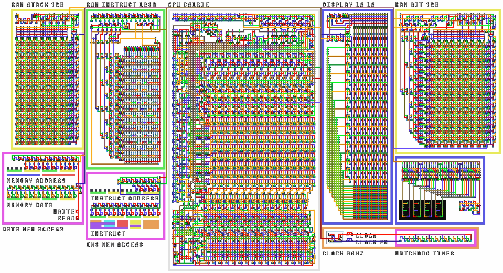

逻辑电路，计算机电路；

::::

:::: {.admonition .quote}
**Quote 2**

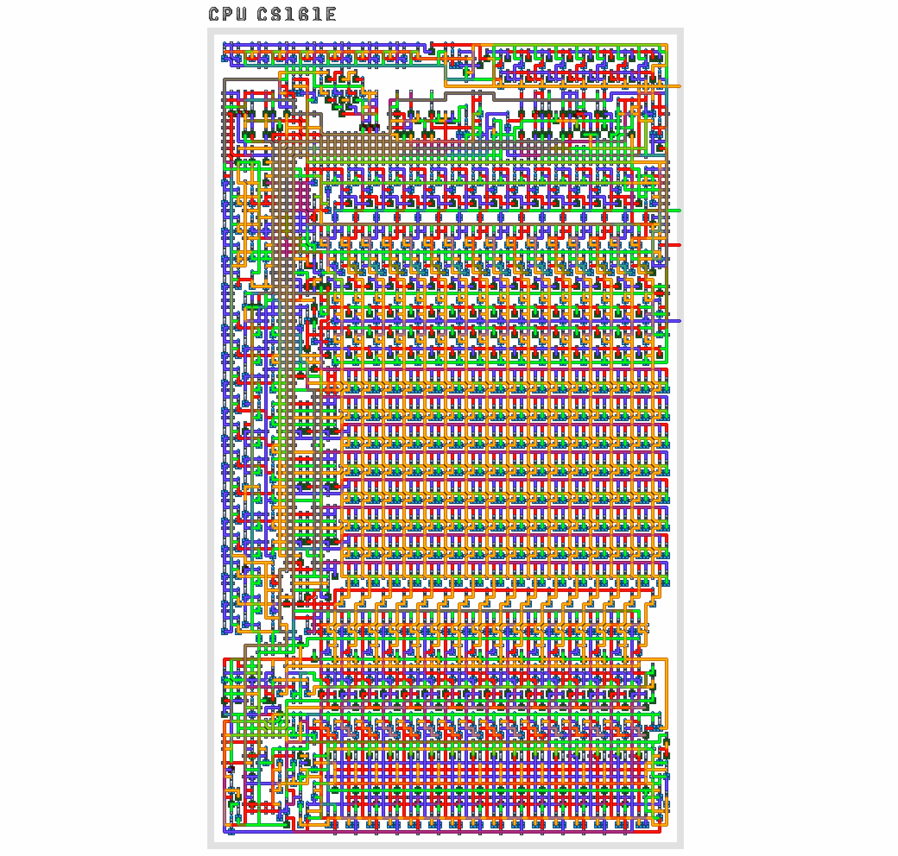

电路模块，嵌入式中央处理器（CPU） CS161E；

::::

:::: {.admonition .quote}
**Quote 3**

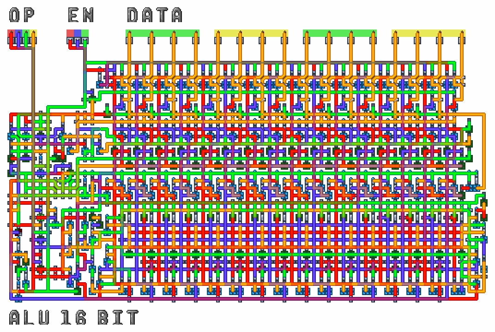

电路模块，算术逻辑单元（ALU）；

::::

:::: {.admonition .quote}
**Quote 4**

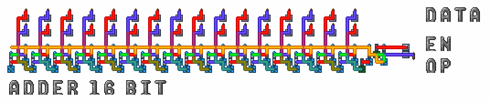

电路部件，时序逻辑加法器（累加器）；

::::

:::: {.admonition .quote}
**Quote 5**


电路元件，T 触发器。

::::
在这个例子中，每一级逻辑电路部分中都能找到下一级逻辑电路部分。

:::
##### 组成

对于逻辑电路部分，由一个或多个全逻辑门构成，这些逻辑门（灯）被称为 **内部逻辑门（灯）**，简称 **内部门（灯）**；而不包括在该逻辑电路部分的逻辑门（灯）被称为 **外部逻辑门（灯）**，简称 **外部门（灯）**。连接的所有逻辑门（灯）都是内部门（灯），且其下没有物理电源和用电器的电线，被称为 **内部电线**；连接的逻辑门（灯）中存在外部门（灯），或其下有物理电源或用电器的电线，被称为 **外部电线**。

逻辑电路部分是由 **内部逻辑门、内部逻辑灯、内部电线、外部电线** 组成的。


::: {.admonition .example}
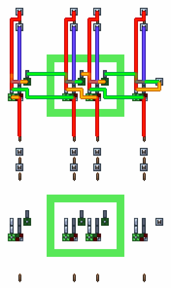

示例电路模块。

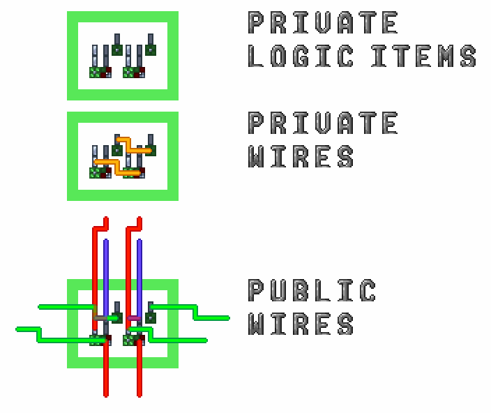

电路模块由内部逻辑门、内部逻辑灯、内部电线、外部电线组成。

:::
##### 端口

每个外部电线都是逻辑电路部分与外部电路交流的 **端口**，外部电路对逻辑电路部分、逻辑电路对外部电路施加的影响完全通过端口进行。

端口分为 **输入端口、输出端口、输入输出端口**。数据通过输入端口输入逻辑电路部分，通过输出端口从逻辑电路部分输出，输入输出端口可以输入数据也可以输出数据。

* 当外部电线连接的电源中只有外部电源，或用电器中只包括内部逻辑灯时，其端口为输入端口；
* 当外部电线连接的电源中只有内部逻辑门，或用电器中只包括外部用电器时，其端口为输出端口；
* 当外部电线同时连接内部逻辑灯、内部逻辑门与外部电源、外部用电器 ，其端口为输入输出端口。


::: {.admonition .tip}
本教程中，会使用火把表示电路模块的输出端口，会同时使用开关和火把表示电路模块的输入端口和输入输出端口。

:::

::: {.admonition .example}
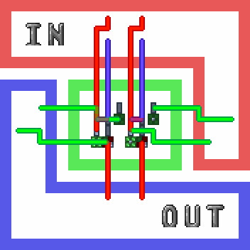

上述示例模块中，可以将外部电线分为输入端口和输出端口。

:::
在分析逻辑电路部分时，我们可以应用黑箱理论，只需要考虑端口的输入输出间的关系，而完全不需要考虑其内部实现。当我们使用外部电路产生满足输入端口格式的数据，并接受满足输出端口格式的数据，即可正常使用逻辑电路部分，像其在其它电路中一样。


::: {.admonition .example}

:::: {.admonition .question}
以下上述示例模块在不同电路中的应用，你能找出它们吗？

::::

:::: {.admonition .quote}
**Quote 1**


::::

:::: {.admonition .quote}
**Quote 2**

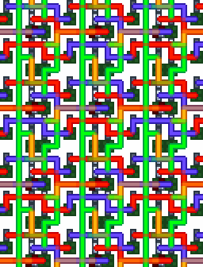

::::

:::: {.admonition .quote}
**Quote 3**


::::

:::: {.admonition .quote}
**Quote 4**


::::

:::: {.admonition .quote}
**Quote 5**

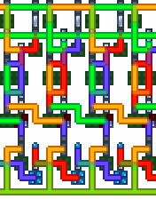

::::

:::: {.admonition .quote}
**Quote 6**

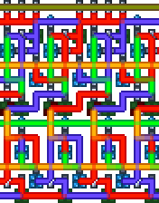

::::
:::
##### 标准电路

在逻辑电路中，存在大量重复的部分，我们将多个逻辑电路中会多次用到的部分逻辑电路总结为 **标准电路元件、标准电路部件、标准电路模块**，统称标准电路。通常大部分电路需求都可以完全使用标准电路实现。


::: {.admonition .tip}
越大的标准电路的泛用性越差，并且通常需要根据具体情况调整。

:::
对于标准电路，我们需要关注它的输入与输出端口格式，以及输入与输出间的关系。当我们掌握某一标准电路的这两点后，我们可以在任何需要它的电路中一致的使用它。后续章节中出现的电路元件、电路部件、电路模块都是总结出的标准电路。


::: {.admonition .example}
上述示例模块就是标准电路部件组合逻辑加法器，是最常用的标准组合逻辑部件之一，在大部分计算电路中都有使用，将会在下文详细介绍。
:::


<div STYLE="page-break-after: always;"></div>

## 第三章 逻辑电路

### 3.1 组合逻辑

#### 3.1.1 基本逻辑运算

泰拉瑞亚组合逻辑电路中存在四种基本逻辑运算：**非、异或、与、独热**。其中非和异或使用逻辑灯完成；与和独热使用逻辑门完成。


::: {.admonition .info}
现实组合逻辑电路中存在三种基本逻辑运算：**与、或、非**。

:::

::: {.admonition .tip}
线或应用于激活用电器，属于时序逻辑电路，此外组合逻辑电路中并不会使用或门，所以或并不属于组合逻辑电路的基本逻辑运算。

:::
##### 非

$$y = \lnot a$$

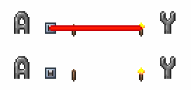

##### 异或

$$y = a \oplus b$$

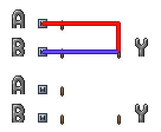

##### 与

$$y = a \land b$$

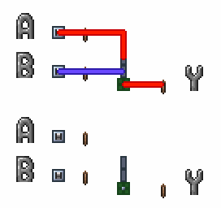

##### 独热

$$y = \mathrm{OneHot}(a, b)$$


#### 3.1.2 更多逻辑运算

除了基本逻辑结算和前面介绍的常用逻辑运算外，组合逻辑中还有另外一些经常使用的逻辑运算。

##### 比较

比较运算是比较两个变量的大小或关系，当条件成立时输出 1，否则输出 0。

对于两个变量，可以定义六种基本的比较关系：**小于（LT）、大于（GT）、小于等于（LE）、大于等于（GE）、等于（EQ）、不等于（NE）**。它们在所有输入情况下的输出如下表所示：

| > | 输入 | > | > | > | > | > | 输出 |
| --- | --- | --- | --- | --- | --- | --- | --- |
| a | b | $a < b$ | $a > b$ | $a <= b$ | $a >= b$ | $a == b$ | $a\ != b$ |
| 0 | 0 | 0 | 0 | 1 | 1 | 1 | 0 |
| 0 | 1 | 1 | 0 | 0 | 1 | 0 | 1 |
| 1 | 0 | 0 | 1 | 1 | 0 | 0 | 1 |
| 1 | 1 | 0 | 0 | 1 | 1 | 1 | 0 |


::: {.admonition .info}
与运算只有在所有输入都为 1 时才输出 1，其余情况输出 0：

$$
a_1 \land a_2 \land \cdots \land a_n = 
\left\{
    \begin{array}{ll}
        1 & \textrm{当 } a_1 = a_2 = \cdots = a_n = 1 \textrm{ 时} \\
        0 & \textrm{其他情况}
    \end{array}
\right.
$$


:::: {.admonition .example}


只有在输入 $a_1$ ~ $a_4$ 全为 1 时，输出才为 1；其余情况输出 0。

::::
如果将与运算的所有输入取反，则逻辑变为：所有输入都为 0 时输出 1，否则输出 0：

$$
\lnot a_1 \land \lnot a_2 \land \cdots \land \lnot a_n = 
\left\{
    \begin{array}{ll}
        1 & \textrm{当 } a_1 = a_2 = \cdots = a_n = 0 \textrm{ 时} \\
        0 & \textrm{其他情况}
    \end{array}
\right.
$$


:::: {.admonition .example}


只有在输入 $a_1$ ~ $a_4$ 全为 0 时，输出才为 1；其余情况输出 0。

::::
若只对部分输入取反，则该逻辑在“未取反的输入为 1，取反的输入为 0”时输出 1，其余情况输出 0：

$$
a_1 \land a_2 \land \cdots \land a_m \land \lnot b_1 \land \lnot b_2 \land \cdots \land \lnot b_n = 
\left\{
    \begin{array}{ll}
        1 & \textrm{当 } a_1 = a_2 = \cdots = a_n = 1 \textrm{ 且} \\ 
            & b_1 = b_2 = \cdots = b_n = 0 \textrm{ 时} \\
        0 & \textrm{其他情况}
    \end{array}
\right.
$$


:::: {.admonition .example}


只有在输入 $a_1$ ~ $a_2$ 全为 1 且 $a_1$ ~ $a_2$ 全为 0 时，输出才为 1；其余情况输出 0。

::::
这种只在真值表中某一行输出为 1 的逻辑表达式称为 **最小项**。


:::: {.admonition .example}
对于三输入逻辑函数，若只希望在 $a = 0,\ b = 1,\ c = 1$ 时输出 1，可以使用最小项 $\lnot a \land b \land c$，该表达式仅在这一输入组合下输出 1。


::::: {.admonition .quote}


只有在输入 $a = 0,\ b = 1,\ c = 1$ 时，输出才为 1；其余情况输出 0。

:::::
::::
最小项中每个输入逻辑变量都会出现，且只会出现一次；每个变量在最小项中都有“取反”和“不取反”两种情况。因此对于 $n$ 个变量，一共有 $2^n$ 个最小项，恰好对应真值表的每一行。任意输入，都只会有一个最小项输出为 1。


:::: {.admonition .example}
三输入变量对应的最小项如下：

| > | > | 输入 | 输出为 1 最小项 |
| --- | --- | --- | --- |
| a | b | c | y |
| 0 | 0 | 0 | $\lnot a \land \lnot b \land \lnot c$ |
| 0 | 0 | 1 | $\lnot a \land \lnot b \land c$ |
| 0 | 1 | 0 | $\lnot a \land b \land \lnot c$ |
| 0 | 1 | 1 | $\lnot a \land b \land c$ |
| 1 | 0 | 0 | $a \land \lnot b \land \lnot c$ |
| 1 | 0 | 1 | $a \land \lnot b \land c$ |
| 1 | 1 | 0 | $a \land b \land \lnot c$ |
| 1 | 1 | 1 | $a \land b \land c$ |

可以看到真值表中某变量为 0，对应最小项中该变量取反；为 1，则不取反。


::::: {.admonition .quote}


三输入全部可能的最小项，一共有 $2^3 = 8$ 个最小项。

:::::
::::
当输出为 1 的情况不止一个时，可以将对应的最小项用异或连接。由于任意输入下最多只有一个最小项为 1，异或运算即可正确合并这些情况。这种由异或连接的最小项称为 **最小项之和**，它可以表示任意逻辑函数。


:::: {.admonition .example}
对于下表所示的三输入逻辑函数：

| > | > | 输入 | 输出 |
| --- | --- | --- | --- |
| a | b | c | y |
| 0 | 0 | 0 | 0 |
| 0 | 0 | 1 | 0 |
| 0 | 1 | 0 | 0 |
| 0 | 1 | 1 | 1 |
| 1 | 0 | 0 | 0 |
| 1 | 0 | 1 | 1 |
| 1 | 1 | 0 | 1 |
| 1 | 1 | 1 | 1 |

其逻辑表达式可写为：

$$\lnot a \land b \land c \oplus a \land \lnot b \land c \oplus a \land b \land \lnot c \oplus a \land b \land c$$

对应四个输出为 1 的最小项之和。


::::: {.admonition .quote}


满足该真值表对应逻辑函数的电路。

:::::
::::
:::
利用最小项之和，可以得到六种比较运算对应的逻辑表达式：

| 运算 | 记号 | 逻辑表达式 |
| --- | --- | --- |
| 小于 | $a < b$ | $\lnot a \land b$ |
| 大于等于 | $a >= b$ | $\lnot (\lnot a \land b)$ |
| 大于 | $a > b$ | $a \land \lnot b$ |
| 小于等于 | $a <= b$ | $\lnot (a \land \lnot b)$ |
| 不等于 | $a\ != b$ | $a \oplus b$ |
| 等于 | $a == b$ | $\lnot (a \oplus b)$ |


::: {.admonition .tip}
可以看到，小于和大于等于、大于和小于等于、不等于和等于两两互为取反；小于和大于、小于等于和大于等于的区别是交换两个输入。在比较电路中，常利用这一性质减少所需的逻辑门数量。


:::: {.admonition .example}


* **NOT OUT** 控制是否对输出取反，以在小于（**LT**）和大于等于（**GE**）、大于（**GT**）和小于等于（**LE**）、等于（**EQ**）和不等于（**NE**）间切换；
* **SW IN** 交换两个输入，以在小于（**LT**）和大于（**GT**）、大于等于（**GE**）和小于等于（**LE**）间切换；

::::
:::
##### 乘（MUL）

两个变量乘运算的逻辑表达式为：

$$a \cdot b$$


::: {.admonition .info}
读作 a 乘 b。

:::
或者简写为：

$$ab$$

$n$ 个变量乘运算的逻辑表达式为：

$$a_1 \cdot a_2 \cdot \cdots \cdot a_n$$

或者简写为：

$$a_1 a_2 \cdots a_n$$

由乘法关系：

$0 \cdot 0 = 0$
$0 \cdot 1 = 0$
$1 \cdot 0 = 0$
$1 \cdot 1 = 1$

可列出真值表：

| > | 输入 | 输出 |
| --- | --- | --- |
| a | b | y |
| 0 | 0 | 0 |
| 0 | 1 | 0 |
| 1 | 0 | 0 |
| 1 | 1 | 1 |


::: {.admonition .tip}
可以发现与运算就是乘法运算。

$$a \cdot b = a \land b$$


:::

::: {.admonition .info}
任何数乘以 0 等于 0，任何数乘以 1 等于其本身。

$$0 \cdot a = 0$$

$$1 \cdot a = a$$


任何数乘以本身等于其本身。

$$a \cdot a = a$$

易得：

$$a \cdot a \cdot \cdots \cdot a = a$$


:::: {.admonition .tip}
证明可通过观察真值表完成。

::::


:::
##### 加（ADD）、减（SUB）

两个变量加运算的逻辑表达式为：

$$a + b$$


::: {.admonition .info}
读作 a 加 b。

:::
$n$ 个变量加运算的逻辑表达式为：

$$a_1 + a_2 + \cdots + a_n$$


::: {.admonition .question}
$$1 + 1 = \ ?$$

如果是在实数域，我们可以很容易的说出 $1 + 1 = 2$ ，但是在逻辑量中并没有 $2$。实际上，在逻辑运算中 $1 + 1 = 0$。

我们可以用两种方式理解这个结果：

* 如果是有进位加法 $(1 + 1 = 10)_2$，由于逻辑函数只有一位输出，所以抛弃高位的 $1$，只保留低位的 $0$；
* 加法可以理解为在数轴上从一个加数出发，前进另一个加数的距离，对于一个只有 $0$ 和 $1$ 首尾相连的循环数轴，如果从 $1$ 出发前进 $1$，就会到达 $0$。

$$\cdots \xrightarrow{+1} 1 \xrightarrow{+1} 0 \xrightarrow{+1} 1 \xrightarrow{+1} 0 \xrightarrow{+1} 1 \xrightarrow{+1} 0 \xrightarrow{+1} 1 \xrightarrow{+1} \cdots$$

:::
由加法关系：

$0 + 0 = 0$
$0 + 1 = 1$
$1 + 0 = 1$
$1 + 1 = 0$

可列出真值表：

| > | 输入 | 输出 |
| --- | --- | --- |
| a | b | y |
| 0 | 0 | 0 |
| 0 | 1 | 1 |
| 1 | 0 | 1 |
| 1 | 1 | 0 |


::: {.admonition .tip}
可以发现异或运算就是加法运算。

$$a + b = a \oplus b$$


:::: {.admonition .tip}
双输入异或和独热等价，为便于理解，图中包括使用双灯异或门实现的异或逻辑。

$$a \oplus b = \mathrm{OneHot}(a, b)$$

::::
:::

::: {.admonition .info}
任何数加 0 等于其本身，任何数加 1 等于其本身的非。

$$a + 0 = a$$

$$a + 1 = \lnot a$$


:::: {.admonition .tip}
线异或两项中的一项恒为 1 相当于线非。

::::
任何数加本身等于 0。

$$a + a = 0$$

易得：

$$\underbrace{a + a + \cdots + a}_{n} = \begin{cases} 0, & n = 2k, \\[4pt] a, & n = 2k+1, \end{cases} \qquad k \in \mathbb{n}.$$


:::: {.admonition .tip}
证明可通过观察真值表完成。

::::


:::: {.admonition .tip}
奇数个相同项相加等于其本身，偶数个相同项相加等于 0。

::::


:::

::: {.admonition .tip}
逻辑运算的结果也是逻辑量，这里的乘法和加法是逻辑量间的一位不进位乘和一位不进位加，并非我们在现实中常见的多位有进位乘和多位有进位加。

$$y = (a \cdot b) \bmod 2$$

$$y = (a + b) \bmod 2$$

由于逻辑量和逻辑运算都在 $GF(2)$ 上，所以可以省略 $\bmod \ 2$。

:::
观察上述数轴可以发现，从一个数出发，向左或向右前进相同距离的结果是一样的。

$$\cdots \xrightleftharpoons[\,-1\,]{\,+1\,} 1 \xrightleftharpoons[\,-1\,]{\,+1\,} 0 \xrightleftharpoons[\,-1\,]{\,+1\,} 1 \xrightleftharpoons[\,-1\,]{\,+1\,} 0 \xrightleftharpoons[\,-1\,]{\,+1\,} 1 \xrightleftharpoons[\,-1\,]{\,+1\,} 0 \xrightleftharpoons[\,-1\,]{\,+1\,} 1 \xrightleftharpoons[\,-1\,]{\,+1\,} \cdots$$

所以可以得出结论：

$$a + b = a - b$$

也就是说，在逻辑运算中，**加减等价**。


::: {.admonition .info}
令 $a = 0$，可得出以下推论：

$$b = -b$$


:::: {.admonition .tip}
取反指非运算，并不是取相反数。

::::
:::
#### 3.1.3 逻辑运算律

##### 交换律、结合律、分配律

加法和乘法满足交换律：

$$a + b = b + a$$

$$a \cdot b = b \cdot a$$


::: {.admonition .example}


:::
加法和乘法满足结合律：

$$a + (b + c) = (a + b) + c$$

$$a \cdot (b \cdot c) = (a \cdot b) \cdot c$$


::: {.admonition .example}


:::
加法不满足分配律，乘法满足分配律：

$$a + b \cdot c \neq (a + b) \cdot (a + c)$$

$$a \cdot (b + c) = a \cdot b + a \cdot c$$


::: {.admonition .example}


:::
运算符 $+$、$-$、$\cdot$ 属于代数运算符，使用代数运算符连接的式子被称为 **代数运算式**，简称 **代数式**。相同运算符的运算次序是 **先左后右**，而不同运算符的运算次序是 **先乘法再加法**，若有括号，则 **先进行括号内运算**。


::: {.admonition .example}

:::: {.admonition .question}
证明：任何数乘以本身的非等于 0。

$$a \cdot \lnot a = 0$$

::::

:::: {.admonition .quote}
$$\begin{array}{lll} a \cdot \lnot a & = & a \cdot (a + 1) \\ & = & a \cdot a + a \\ & = & a + a \\ & = & 0 \end{array}$$

::::


:::

::: {.admonition .example}

:::: {.admonition .question}
证明：
$$a \land b = (\lnot a \oplus b) \land b$$

::::

:::: {.admonition .quote}
$$\begin{array}{lll} (\lnot a \oplus b) \land b & = & (a + 1 + b) \cdot b \\ & = & a \cdot b + b + b \cdot b \\ & = & a \cdot b + b + b \\ & = & a \cdot b\end{array}$$

::::

:::: {.admonition .tip}
有时会需要让与门上某些电线从特定逻辑灯引出，这时可以使用这个技巧重叠电线。


::::
:::
##### 普通灯

普通灯是异或逻辑（线异或），输入是其上所有电线连接的所有电源状态和普通灯初始状态，输出是普通灯状态。其上电线连接 $m$ 个电源的普通灯代数式中有 $m$ 项相加，每一项都对应一个其上电线连接的电源，然后再加上普通灯初始状态，灭灯为 0，亮灯为 1。


::: {.admonition .quote}
$$\mathrm{Lamp}(s_1,\cdots,s_m;l_0) = \sum_{i=1}^{m} s_i + l_0$$

$m$ 电源输入的普通灯代数式，$l_0$ 是普通灯本身状态，灭为 0，亮为 1。

:::

::: {.admonition .example}
有时会需要让某根电线穿过双灯异或门而不干扰异或门逻辑。

设异或的两个输入分别为 $m$ 和 $n$，输出为 $y$，则：

$$y = m + n$$

令 $m = a + b,\ n = b$ 则：

$$y = (a + b) + b = a$$


$y$ 始终等于 $a$，与 $b$ 的值无关。

:::
##### 与门

与门是与逻辑，输入是其上所有普通灯状态，输出是与门状态，输入输出间关系满足与逻辑。其上有 $n$ 个灯的与门代数式中有 $n$ 项相乘，每一项都对应一个其上普通灯。当与门状态与输出用电器相反时，完整表达式会在与门表达式的基础上加 1 取反。


::: {.admonition .quote}
$$\mathrm{AndGate}(l_1,\cdots,l_n) = \prod_{j=1}^{n} l_j$$

$n$ 灯输入与门代数式。

:::
将普通灯代数式带入与门代数式即可得到由普通灯和与门组成的全与门的代数式。


::: {.admonition .quote}
设与门上第 $j$ 个普通灯表达式如下：

$$l_{1j} = \mathrm{Lamp}(s_{j1},\cdots,s_{jk_j};l_{0j})$$

则全与门代数式如下：

$$
\mathrm{FullAndGate} 
\Big(
    \{s_{ji}\}_{
        \substack{
            1\le j\le n \\
            1\le i\le k_j
        }
    }; 
    \{l_{0j}\}_{j=1}^{n}
\Big) = 
\prod_{j=1}^{n} 
\left(
    \sum_{i=1}^{k_j} s_{ji} + l_{0j} 
\right)
$$

:::

::: {.admonition .example}

:::: {.admonition .question}
写出下列全与门的代数式：


::::
* $Y_1 = (A + B + 1)(A + B + C)A$

* $Y_2 = (A + C)(A + B + C + 1)C + 1$

* $Y_3 = (B + 1)(A + B + C + 1)(C + 1) + 1$

* $Y_4 = B(A + B + C)(A + 1)$

:::
如果代数式或加一后的代数式可因式分解，每一个因式里只含加法不含乘法，则其对应的逻辑可以只用一个与门实现。


::: {.admonition .tip}
既代数式可以写成如下形式时，对应逻辑可以只用一个与门实现。

$$
f = \prod_{j=1}^{n} \left(\sum_{i} s_{ji} + l_{0j} \right) 
\quad 
\text{or} 
\quad 
f + 1 = \prod_{j=1}^{n} \left(\sum_{i} s_{ji} + l_{0j} \right)
$$

:::
能只使用一个逻辑门实现的逻辑被称为 **简单逻辑**。


::: {.admonition .example}
或运算逻辑式：

$$a \lor b = \lnot (\lnot a \land \lnot b)$$

或运算代数式：

$$ab + a + b$$


:::: {.admonition .quote}
$$
\begin{array}{lll} 
    a \lor b 
    & = & \lnot (\lnot a \land \lnot b) \\ 
    & = & (a + 1)(b + 1) + 1 \\ 
    & = & ab + a + b + 1 + 1 \\ 
    & = & ab + a + b 
\end{array}
$$

::::
或运算代数式可以使用因式分解将其写成因式里只含加法的形式：

$$\begin{array}{lll} ab + a + b & = & ab + a + b + 1 - 1 \\ & = & (a + 1)(b + 1) + 1 \end{array}$$

所以或逻辑可以只用一个与门实现。


:::: {.admonition .tip}
这里利用了推论 $1 = -1$。

::::


:::

::: {.admonition .example}
逻辑式：

$$(a \lor b) \land (c \lor d)$$

代数式：

$$(ab + a + b)(cd + c + d)$$

代数式及代数式加一都不可将因式中的乘法消除，因此不可只用一个与门表示。


:::
##### 异或门

异或门是独热逻辑，输入是其上所有普通灯状态，输出是异或门状态，输入输出间关系满足独热逻辑。其上有 $n$ 个灯的异或门代数式中有 $n$ 个逻辑变量，每一个逻辑变量都对应一个其上普通灯。当异或门状态与输出用电器相反时，完整表达式会在异或门表达式的基础上加 1 取反。


::: {.admonition .quote}
考虑三输入独热真值表：

| > | > | 输入 | 输出 |
| --- | --- | --- | --- |
| A | B | C | Y |
| 0 | 0 | 0 | 0 |
| 0 | 0 | 1 | 1 |
| 0 | 1 | 0 | 1 |
| 0 | 1 | 1 | 0 |
| 1 | 0 | 0 | 1 |
| 1 | 0 | 1 | 0 |
| 1 | 1 | 0 | 0 |
| 1 | 1 | 1 | 0 |

使用最小项之和写出逻辑式：

$$\mathrm{OneHot}(a, b, c) = \lnot a \land \lnot b \land c \oplus \lnot a \land b \land \lnot c \oplus a \land \lnot b \land \lnot c$$

转换为代数式：

$$
\begin{array}{lll} 
    \mathrm{OneHot}(a, b, c) 
    & = & (a + 1)(b + 1)c + (a + 1)b(c + 1) + a(b + 1)(c + 1) \\ 
    & = & (ab + a + b + 1)c + \\ 
    & & (ac + a + c + 1)b + \\ 
    & & (bc + b + c + 1)a \\ 
    & = & abc + ac + bc + c + \\ 
    & & abc + ab + bc + b + \\ 
    & & abc + ab + ac + a \\ 
    & = & abc + a + b + c
\end{array}
$$


:::: {.admonition .tip}
这里利用了推论 $a + a = 0$，出现奇数次的项被保留，偶数次的项被消掉。

::::
同理四输入独热的表达式为：

$$\mathrm{OneHot}(a, b, c, d) = abc + abd + acd + bcd + a + b + c + d$$


:::: {.admonition .tip}
证明留给读者进行，同样是奇数次的项被保留，偶数次的项被消掉。

::::
:::

::: {.admonition .quote}
由上述结论推广可得：

$$
\mathrm{XorGate}(l_1,\cdots,l_n) = 
\sum_{
    \substack{
        i \subseteq \{1,\cdots,n\} \\ 
        |i| \equiv 1 \pmod{2}
    }
} \; 
\prod_{i \in i} l_i
$$

$n$ 灯输入异或门代数式。

:::
将普通灯代数式带入异或门代数式即可得到由普通灯和异或门组成的全异或门的代数式。


::: {.admonition .quote}
设异或门上第 $j$ 个普通灯表达式如下：

$$l_{1j} = \mathrm{Lamp}(s_{j1},\cdots,s_{jk_j};l_{0j})$$

则全异或门代数式如下：

$$
\mathrm{FullXorGate} 
\Big(
    \{s_{ji}\}_{\substack{
            1\le j\le n \\ 
            1\le i\le k_j
        }
    }; 
    \{l_{0j}\}_{j=1}^{n}
\Big) \\ = 
\sum_{
    \substack{
            I \subseteq \{1, \cdots, n\} \\ 
            |I| \equiv 1 \pmod{2}
        }
    } \; 
\prod_{j \in I} 
\left(
    \sum_{i=1}^{k_j} s_{ji} + l_{0j} 
\right)
$$

:::

::: {.admonition .tip}
同理，如果代数式可以写成如下形式时，对应逻辑可以只用一个异或门实现。

$$
f = \sum_{
    \substack{
        I \subseteq \{1,\cdots,n\} \\ 
        |I| \equiv 1 \pmod{2}
    }
} \; 
\prod_{i \in I} 
\left(
    \sum_{i=1}^{k_j} s_{ji} + l_{0j} 
\right) \\ 
\text{or} \\ 
f + 1 = \sum_{
    \substack{
        I \subseteq \{1,\cdots,n\} \\ 
        |I| \equiv 1 \pmod{2}
    }
} \; 
\prod_{i \in I} 
\left(
    \sum_{i=1}^{k_j} s_{ji} + l_{0j} 
\right)
$$

:::

::: {.admonition .example}

:::: {.admonition .question}
写出下列全异或门的代数式：


::::
三灯异或门的代数式为：

$$f = xyz + x + y + z$$

* $y_1 = (a + b + 1)(a + b + c)b + (a + b + 1) + (a + b + c) + b$
$x = a + b + 1,\ y = a + b + c,\ z = b$

* $y_2 = (b + 1)(a + b + c + 1)(c + 1) + (b + 1) + (a + b + c + 1) + (c + 1) + 1$
$x = b + 1,\ y = a + b + c + 1,\ z = c + 1$

* $y_3 = b(a + b + c + 1)a + b + (a + b + c + 1) + a + 1$
$x = b,\ y = a + b + c + 1,\ z = a$

* $y_4 = a(a + b + c)(a + c + 1) + a + (a + b + c) + (a + c + 1) + 1$
$x = a,\ y = a + b + c,\ z = a + c + 1$

:::

::: {.admonition .example}
观察下方电路：


写出代数式为：

$$(abc + a + b + c) + a + b + c = abc$$

满足与逻辑。

观察下方电路：


写出代数式为：

$$(abc) + a + b + c = abc + a + b + c$$ 

满足独热逻辑。

可见可以用与门实现异或门的独热逻辑，也可以用异或门实现与门的与逻辑。

:::

::: {.admonition .example}
三灯异或门的代数式为：

$$f = abc + a + b + c$$

令逻辑灯 $a = x + y,\ b = x + y,\ c = y$，则：

$$f = (x + y)(x + y)y + (x + y) + (x + y) + y = xy$$

满足二输入与逻辑。


:::

::: {.admonition .example}
三灯异或门的代数式为：

$$f = abc + a + b + c$$

令逻辑灯 $a = x + 1,\ b = y + 1,\ c = 1$，则：

$$f = (x + 1)(y + 1)1 + (x + 1) + (y + 1) + 1 = xy$$

满足二输入与逻辑。


:::

::: {.admonition .info}
易证：

$$\mathrm{OneHot}(0, a_1, a_2, \cdots, a_n) = \mathrm{OneHot}(a_1, a_2, \cdots, a_n)$$

$$\mathrm{OneHot}(1, a_1, a_2, \cdots, a_n) = \lnot a_1 \land \lnot a_2 \land \cdots \land \lnot a_n$$

:::

::: {.admonition .example}
三灯异或门的代数式为：

$$f = abc + a + b + c$$

令逻辑灯 $a = x,\ b = y,\ c = 1,\ z = f + 1$，则：

$$z = (xy1 + x + y + 1) + 1 = xy + x + y$$

满足二输入或逻辑。


:::
#### 3.1.4 逻辑函数

##### 最小项

任意逻辑函数可以被写成积之和的形式。如果乘积项中每个逻辑变量只出现一次，则该乘积项被称为 **最小项**。每一个最小项对应一个让逻辑函数输出为真的输入情况，而每个让逻辑函数输出为真的输入情况也可以对应写作一个最小项。

对于一个有 $j$ 种输入输出为真的逻辑函数，其逻辑表达式可以被写作 $j$ 个最小项求和的形式，被称为 **最小项之和**。和真值表中输出为 1 的数量一样，$j$ 最小为 $0$，最大为 $2^n$，其中 $n$ 为输入的逻辑变量数。


::: {.admonition .info}
最小项可以被简写为 $m_i$ 的形式，其中 $i$ 代表该最小项输出为真时对应输入转换为十进制的值。


:::: {.admonition .example}
三输入变量对应的最小项和简写如下：

| > | > | 输入 | 最小项 | 简写 |
| --- | --- | --- | --- | --- |
| 0 | 0 | 0 | $\lnot a \cdot \lnot b \cdot \lnot c$ | $m_0$ |
| 0 | 0 | 1 | $\lnot a \cdot \lnot b \cdot c$ | $m_1$ |
| 0 | 1 | 0 | $\lnot a \cdot b \cdot \lnot c$ | $m_2$ |
| 0 | 1 | 1 | $\lnot a \cdot b \cdot c$ | $m_3$ |
| 1 | 0 | 0 | $a \cdot \lnot b \cdot \lnot c$ | $m_4$ |
| 1 | 0 | 1 | $a \cdot \lnot b \cdot c$ | $m_5$ |
| 1 | 1 | 0 | $a \cdot b \cdot \lnot c$ | $m_6$ |
| 1 | 1 | 1 | $a \cdot b \cdot c$ | $m_7$ |

::::
最小项之和可以被写为形如 $m_i + m_j + \cdots + m_k = \sum_{}^{} m(i, j, \cdots, k)$ 的形式。


:::: {.admonition .example}
对于下表所示的三输入逻辑函数：

| > | > | 输入 | 输出 |
| --- | --- | --- | --- |
| a | b | c | y |
| 0 | 0 | 0 | 0 |
| 0 | 0 | 1 | 0 |
| 0 | 1 | 0 | 0 |
| 0 | 1 | 1 | 1 |
| 1 | 0 | 0 | 0 |
| 1 | 0 | 1 | 1 |
| 1 | 1 | 0 | 1 |
| 1 | 1 | 1 | 1 |

其最小项之和的形式可以写为：

$$\lnot a \cdot b \cdot c + a \cdot \lnot b \cdot c + a \cdot b \cdot \lnot c + a \cdot b \cdot c$$

也可以简写为：

$$m_3 + m_5 + m_6 + m_7 = \sum_{}^{} m(3, 5, 6, 7)$$

::::
:::
通常我们已知逻辑函数，需要找到满足逻辑函数的电路表示。此时我们需要先将逻辑函数写成积之和，也就是最小项之和的形式，然后将积之和转换为和之积，以满足与门或异或门的格式。但利用运算律和因数分解进行转换都是比较困难的。

##### 字符串

在逻辑表达式中，逻辑量也被称为 **字母**，而若干字母使用加法连接而成的表达式被称为 **字符串**，简称 **串**。

由 0 个字符连接成的表达式记作 0，称为 **空串**；0 和 1 两个串称为 **平凡串**；除 0 和 1 外的串被称为 **非平凡串**。如果两个串恒等（等价），那么这两个串相同。


::: {.admonition .info}
字母顺序不同的串仍等价：

$$a + b = b + a$$

连接 1 相当于对字母取反：

$$a + 1 = \lnot a$$

连接 0 可以直接消掉：

$$a + 0 = a$$

一对重复字母可以抵消：

$$a + a = 0$$

:::
对于 $n$ 个字母，可以组成 $2^n$ 个不同的串，每个字母在串中都有存在和不存在两种可能。


::: {.admonition .example}
由字母 $1$、$a$、$b$ 组成的不同的串有 8 个：$0$、$1$、$a$、$b$、$a + b$、$a + 1$、$b + 1$、$a + b + 1$。


:::: {.admonition .tip}
一个串中可以包含重复的字母，但是由于性质 $a + a = 0$ 和 $a + 0 = a$，一对重复字母可以直接抵消。

::::
:::
给定一组串 $s_1$、$s_2$、$\cdot$、$s_r$，任选其中若干串（至少一个）求和，得到的串称为这组串的一个 **线性组合**。

如果一组非平凡串存在至少一个线性组合为平凡串（0 或 1），那么我们称这组非平凡串 **线性相关**；否则如果一组非平凡串的全部线性组合都是非平凡串，那么我们称这组非平凡串 **线性无关**。一组非平凡串的最大线性无关的子集的大小称为这组非平凡串的 **秩**。


::: {.admonition .example}
考虑三个串 $a + b$、$a + b + c$、$a + b + c + d$。

令

$x = a + b$
$y = a + b + c$
$z = a + b + c + d$

那么 $x$、$y$、$z$ 的所有不同线性组合为：

$x = a + b$
$y = a + b + c$
$z = a + b + c + d$
$x + y = c$
$x + z = c + d$
$y + z = d$
$x + y + z = a + b + d$

所有线性组合都是非平凡串，所以 $a + b$、$a + b + c$、$a + b + c + d$ 线性无关，$\{a + b, a + b + c, a + b + c + d\}$ 的最大线性无关子集就是它本身，其秩为 3。

:::

::: {.admonition .example}
考虑三个串 $a + b$、$b + c$、$a + c$。

令

$x = a + b$
$y = b + c$
$z = a + c$

那么 $x$、$y$、$z$ 的所有不同线性组合为：

$x = a + b$
$y = b + c$
$z = a + c$
$x + y = a + c$
$x + z = b + c$
$y + z = a + b$
$x + y + z = 0$


:::: {.admonition .tip}
注意到：

$x = y + z = a + b$
$y = x + z = b + c$
$z = x + y = a + c$

::::
其中 $x + y + z = 0$ 是平凡串，所以 $a + b$、$b + c$、$a + c$ 线性相关。

$\{a + b, b + c, a + c\}$ 的一个子集是 $\{a + b, b + c\}$

令

$x = a + b$
$y = b + c$

那么 $x$、$y$ 的所有不同线性组合为：

$x = a + b$
$y = b + c$
$x + y = a + c$

都是非平凡串，所以 $a + b$、$b + c$ 线性无关。$\{a + b, b + c\}$ 是 $\{a + b, b + c, a + c\}$ 的其中一个最大线性无关子集，大小为 2。

则 $a + b$、$b + c$、$a + c$ 的秩为 2。

:::
记一组串的秩为 $r$，那么这组串拥有的不同非平凡线性组合数量为 $2^r - 1$。反之，一组串拥有的不同非平凡线性组合数量一定有形式 $2^r - 1$，并且在该形式下这组串的秩为 $r$。


::: {.admonition .example}
考虑三个串：$a + b$、$a + b + c$、$a + b + c + d$，其秩为 3，则其有 $2^3 - 1 = 7$ 个不同的非线性组合：$a + b$、$a + b + c$、$a + b + c + d$、$c$、$c + d$、$d$、$a + b + d$；对于有 7 个不同的非线性组合的多个串，其秩为 $\log_2 (7+1) = 3$。

考虑三个串：$a + b$、$b + c$、$a + c$，其秩为 2，则其有 $2^2 - 1 = 3$ 个不同的非线性组合：$a + b$、$b + c$、$a + c$；对于有 3 个不同的非线性组合的多个串，其秩为 $\log_2(3+1) = 2$。

:::

::: {.admonition .info}
秩为 $r$ 的一组互不相同的非平凡串至多有 $2^r - 1$ 个。$n$ 个互不相同的非平凡串的秩至少为 $\lceil\log_2 (n+1)\rceil$。


:::: {.admonition .example}
对于秩为 3 的一组互不相同的非平凡串，如果用字母 $a$、$b$、$c$ 表示，最多可以写出：$a$、$b$、$c$、$a + b$、$a + c$、$b + c$、$a + b + c$ 七个，也就是三个字母所有可能组成的串去掉 $0$ 剩下的情况。其中任选两个串，其秩至少为 $\lceil\log_2 (2+1)\rceil = 2$，任选三个串，其秩至少为 $\lceil\log_2 (3+1)\rceil = 2$。

::::
:::
##### 单输入单普通灯方程


::: {.admonition .example}

:::: {.admonition .question}
对于逻辑函数 $f(a, b, c)$，当且仅当 $a, b, c = 1, 0, 0$ 或 $0, 1, 1$ 时取值为 1；其余情况取值为 0，求函数 $f$ 的单与门表示。

::::
对于三个字母 $a$、$b$、$c$ 组成的非平凡串，有 $a; b; c; a + b; a + c; b + c; a + b + c$ 七种情况。对于输入 $a, b, c = 1, 0, 0$ 或 $0, 1, 1$，总有线性无关串 $a + b$ 和 $b + c + 1$ 同时为 1。若 $f$ 可以分解为线性因式的乘积，那么这些线性因式在所有使 $f = 1$ 的最小项上，都必须取值为 1，因此，因式一定取自这些在最小项集合上恒等为 1 的非平凡串。不妨构造 $f = (a + b)(b + c + 1)$，经过验证，符合题意。


:::: {.admonition .tip}
当变量数量较少且函数可以被分解为线性因式时，我们可以通过在给定最小项集合上，寻找一组线性无关且恒等为 1 的非平凡串来得到可能的因式。

不过这种方法依赖枚举与观察，接下来将介绍更通用的方法。

::::
:::
考虑前述 $m$ 输入，初始状态 $l_0$ 的普通灯通式：

$$\mathrm{Lamp}(s_1,\cdots,s_m;l_0) = \sum_{i=1}^{m} s_i + l_0$$

当输入的电源并没有全部连接到逻辑灯时，引入表示输入电源 $s_i$ 与逻辑灯的电线连接关系的项 $w_i$，当该电源通过电线连接到逻辑灯时，$w_i = 1$，当该电源没有通过电线连接到逻辑灯时，$w_i = 0$。

设有 $n$ 个输入电源，普通灯的初始状态 $l_0$，普通灯的最终状态 $l_1$。

则该普通灯终态表达式可以写为：

$$\sum_{i=1}^{n} w_i s_i + l_0 = l_1$$

对于这样的表达式，我们可以使用向量简化表示。

设电线连接向量为 $\mathbf{w}$

$$\mathbf{w} = (w_1, \cdots, w_n)$$

设电源状态向量为 $\mathbf{s}$

$$\mathbf{s} = (s_1, \cdots, s_n)$$


::: {.admonition .tip}
$\mathbf{s}$ 和 $\mathbf{w}$ 的维度相同，都是 $n$。标量、向量、矩阵进行乘法和加法运算时，要求对应维度相同。

:::
则该普通灯在输入一个向量后的终态表达式为：

$$\mathbf{w}\, \mathbf{s}^{\mathrm{T}} + l_0 = l_1$$

既：

$$
\begin{pmatrix} 
    w_1 & w_2 & \cdots & w_n 
\end{pmatrix} 
\begin{pmatrix} 
    s_1 \\ s_2 \\ \vdots \\ s_n 
\end{pmatrix} + l_0 = l_1
$$

$$w_1 s_1 + w_2 s_2 + \cdots + w_n s_n + l_0 = l_1$$


::: {.admonition .example}

:::: {.admonition .question}
考虑以下三输入普通灯：


根据电线接法和输入状态，列出普通灯的表达式并求得普通灯终态：


::::
$\mathbf{w}_1 = (1, 0, 1);\ \mathbf{s}_1 = (1, 1, 0);\ l_{01} = 0;$

$
l_{11} = 
\mathbf{w}_1\, \mathbf{s}_1^{\mathrm{T}} + l_{01} = 
\begin{pmatrix} 
    1 & 0 & 1 
\end{pmatrix} 
\begin{pmatrix} 
    1 \\ 1 \\ 0 
\end{pmatrix} + 0 = 
1 + 0 = 1
$

$\mathbf{w}_2 = (0, 1, 1);\ \mathbf{s}_1 = (1, 0, 1);\ l_{02} = 1;$

$
l_{12} = \mathbf{w}_2\, \mathbf{s}_2^{\mathrm{T}} + l_{02} = 
\begin{pmatrix} 
0 & 1 & 1 
\end{pmatrix} 
\begin{pmatrix} 
    1 \\ 0 \\ 1 
\end{pmatrix} + 1 = 
1 + 1 = 0
$

$\mathbf{w}_3 = (1, 0, 0);\ \mathbf{s}_1 = (0, 1, 1);\ l_{03} = 1;$

$
l_{13} = \mathbf{w}_3\, \mathbf{s}_3^{\mathrm{T}} + l_{03} = 
\begin{pmatrix} 
    1 & 0 & 0 
\end{pmatrix} 
\begin{pmatrix} 
    0 \\ 1 \\ 1 
\end{pmatrix} + 1 = 
0 + 1 = 1
$

:::
##### 单输入多普通灯方程

设全普通门上有 $m$ 个普通灯，有 $n$ 个输入电源。其中第 $j$ 个逻辑灯初始状态为 $l_{j0}$，电线连接为 $\mathbf{w}_j$，初态 $l_{0j}$，终态 $l_{1j}$，则其表达式为：

$$l_{1j} = \mathbf{w}_j\,\mathbf{s}^{\mathrm{T}} + l_{0j}$$

对于多个标量，我们可以将它们合并为向量表示；对于多个向量，我们可以将它们合并为矩阵表示。

设电线连接矩阵为 $\mathbf{W}$

$$
\mathbf{W} = 
\begin{pmatrix}
    \mathbf{w}_1 \\
    \mathbf{w}_2 \\
    \vdots \\ 
    \mathbf{w}_m
\end{pmatrix} = 
\begin{pmatrix} 
    w_{11} & w_{12} & \cdots & w_{1n} \\ 
    w_{21} & w_{22} & \cdots & w_{2n} \\ 
    \vdots & \vdots & & \vdots \\ 
    w_{m1} & w_{m2} & \cdots & w_{mn} 
\end{pmatrix}$$

设电源状态向量为 $\mathbf{s}$

$$\mathbf{s} = (s_1, \cdots, s_n)$$

设逻辑灯初态向量为 $\mathbf{l}_0$

$$\mathbf{l}_0 = (l_{01}, \cdots, l_{0m})$$

设逻辑灯终态向量为 $\mathbf{l}_1$

$$\mathbf{l}_1 = (l_{11}, \cdots, l_{1m})$$

则多个普通灯在输入一个向量后的终态表达式为

$$\mathbf{W}\, \mathbf{s}^{\mathrm{T}} + \mathbf{l}_0^{\mathrm{T}} = \mathbf{l}_1^{\mathrm{T}}$$

既：

$$
\begin{pmatrix} 
    w_{11} & w_{12} & \cdots & w_{1n} \\ 
    w_{21} & w_{22} & \cdots & w_{2n} \\ 
    \vdots & \vdots & & \vdots \\ 
    w_{m1} & w_{m2} & \cdots & w_{mn} 
\end{pmatrix} 
\begin{pmatrix} 
    s_1 \\ s_2 \\ \vdots \\ s_n
\end{pmatrix} + 
\begin{pmatrix} 
    l_{01} \\ l_{02} \\ \vdots \\ l_{0m} 
\end{pmatrix} = 
\begin{pmatrix} 
    l_{11} \\ l_{12} \\ \vdots \\ l_{1m} 
\end{pmatrix}
$$


::: {.admonition .example}

:::: {.admonition .question}
考虑以下三输入全普通门上的逻辑灯：


根据电线接法和输入状态，列出全部普通灯的表达式并求得普通灯终态：


::::
$
\mathbf{W}_1 = 
\begin{pmatrix} 
    1 & 1 & 0 \\ 
    0 & 1 & 1 
\end{pmatrix};\ 
\mathbf{s}_1 = (0, 1, 1);\ 
\mathbf{l}_{01} = (1, 1);
$

$
\mathbf{l}_{11} = 
\mathbf{W}_1\, \mathbf{s}_1^{\mathrm{T}} + \mathbf{l}_{01}^{\mathrm{T}} = 
\begin{pmatrix} 
    1 & 1 & 0 \\ 
    0 & 1 & 1 
\end{pmatrix}\, 
\begin{pmatrix} 
    0 \\ 1 \\ 1 
\end{pmatrix} + 
\begin{pmatrix} 
    1 \\ 1 
\end{pmatrix} = 
\begin{pmatrix} 
    1 \\ 0 
\end{pmatrix} + 
\begin{pmatrix} 
    1 \\ 1 
\end{pmatrix} = 
\begin{pmatrix} 
    0 \\ 1 
\end{pmatrix}
$

$
\mathbf{W}_2 = 
\begin{pmatrix} 
    1 & 1 & 0 \\ 
    0 & 0 & 1 
\end{pmatrix};\ 
\mathbf{s}_1 = (1, 0, 1);\ 
\mathbf{l}_{01} = (0, 1);
$

$
\mathbf{l}_{12} = 
\mathbf{W}_2\, \mathbf{s}_2^{\mathrm{T}} + \mathbf{l}_{02}^{\mathrm{T}} = 
\begin{pmatrix} 
    1 & 1 & 0 \\ 
    0 & 0 & 1 
\end{pmatrix}\, 
\begin{pmatrix} 
    1 \\ 0 \\ 1 
\end{pmatrix} + 
\begin{pmatrix} 
    0 \\ 1 
\end{pmatrix} = 
\begin{pmatrix} 
    1 \\ 1 
\end{pmatrix} + 
\begin{pmatrix} 
    0 \\ 1 
\end{pmatrix} = 
\begin{pmatrix} 
    1 \\ 0 
\end{pmatrix}
$

:::
与门在其上全部普通灯点亮时点亮；异或门在其上只有一个普通灯点亮时点亮。也就是说，与门在输入最小项时，其上逻辑灯终态向量全部元素为 1；异或门在输入最小项时，其上逻辑灯终态向量中有且仅有一个元素是 1。而对于非最小项的输入，逻辑灯终态是其余情况，不会满足逻辑门点亮条件，无需关注。


::: {.admonition .quote}
$$\mathbf{W}\, \mathbf{s}^{\mathrm{T}} + \mathbf{l}_0^{\mathrm{T}} = \mathbf{l}_1^{\mathrm{T}}$$

当逻辑门为与门，且输入最小项时，逻辑灯终态向量元素全部为 1。

$$\mathbf{l}_1 = (1, 1, \cdots, 1)$$

当逻辑门为异或门，且输入最小项时，逻辑灯终态向量元素中只有一个 1。

$$\mathbf{l}_1 = (0, 0, \cdots, 0, 1, 0, \cdots, 0)$$

:::

::: {.admonition .example}

:::: {.admonition .question}
将该电路使用最小项之和的形式表示：


::::
由图可得逻辑灯初态向量为 $\mathbf{l}_0 = (0, 1)$，逻辑门为与门，输入为最小项时输出逻辑灯全亮，所以逻辑灯终态向量为 $\mathbf{l}_1 = (1, 1)$，接线矩阵为 $\mathbf{W} = \begin{pmatrix} 1 & 1 & 0 \\ 0 & 1 & 1 \end{pmatrix}$。

设输入最小项向量为 $\mathbf{s} = (a, b, c)$，则

$$\mathbf{W}\, \mathbf{s}^{\mathrm{T}} + \mathbf{l}_0^{\mathrm{T}} = \mathbf{l}_1^{\mathrm{T}}$$

带入可得

$$
\begin{pmatrix} 
    1 & 1 & 0 \\ 
    0 & 1 & 1 
\end{pmatrix}\, 
\begin{pmatrix} 
    a \\ b \\ c 
\end{pmatrix} + 
\begin{pmatrix} 
    0 \\ 1 
\end{pmatrix} = 
\begin{pmatrix} 
    1 \\ 1 
\end{pmatrix}
$$

化简得

$$
\left\{
    \begin{aligned}
        a + b = 1 \\ 
        b + c = 0
    \end{aligned}
\right.
$$

当 $a = 0$ 时，$b = 1$，$c = 1$；

当 $a = 1$ 时，$b = 0$，$c = 0$。

综上，该电路有两个最小项，分别是 $011$ 和 $100$。

:::
##### 多输入多普通灯方程

设全普通门上有 $m$ 个普通灯，有 $n$ 个输入电源，有 $p$ 个输入向量。其中第 $k$ 个输入向量为 $\mathbf{s}_{k}$，对应的逻辑灯初态向量为 $\mathbf{l}_{0k}$，逻辑灯终态向量为 $\mathbf{l}_{1k}$。

同理，当有多个输入向量时，我们也可以将它们合并为矩阵。

设电源状态矩阵为 $\mathbf{S}$

$$
\mathbf{S} = 
\begin{pmatrix} 
    \mathbf{s}_1 \\ 
    \mathbf{s}_2 \\ 
    \vdots \\ 
    \mathbf{s}_p 
\end{pmatrix} = 
\begin{pmatrix} 
    s_{11} & s_{12} & \cdots & s_{1n} \\ 
    s_{21} & s_{22} & \cdots & s_{2n} \\ 
    \vdots & \vdots & & \vdots \\ 
    s_{p1} & s_{p2} & \cdots & s_{pn} 
\end{pmatrix}
$$

设电线连接矩阵为 $\mathbf{W}$

$$
\mathbf{W} = 
\begin{pmatrix}
    \mathbf{w}_1 \\
    \mathbf{w}_2 \\
    \vdots \\
    \mathbf{w}_m
\end{pmatrix} = 
\begin{pmatrix} 
    w_{11} & w_{12} & \cdots & w_{1n} \\
    w_{21} & w_{22} & \cdots & w_{2n} \\ 
    \vdots & \vdots & & \vdots \\ 
    w_{m1} & w_{m2} & \cdots & w_{mn} 
\end{pmatrix}
$$

设逻辑灯初态矩阵为 $\mathbf{L}_0$

$$
\mathbf{L}_0 = 
\begin{pmatrix}
    \mathbf{l}_{01} \\
    \mathbf{l}_{02} \\
    \vdots \\
    \mathbf{l}_{0p}
\end{pmatrix} = 
\begin{pmatrix} 
    l_{011} & l_{012} & \cdots & l_{01m} \\ 
    l_{021} & l_{022} & \cdots & l_{02m} \\ 
    \vdots & \vdots & & \vdots \\ 
    l_{0p1} & l_{0p2} & \cdots & l_{0pm} 
\end{pmatrix}
$$

设逻辑灯终态矩阵为 $\mathbf{L}_1$

$$
\mathbf{L}_1 = 
\begin{pmatrix}
    \mathbf{l}_{11} \\
    \mathbf{l}_{12} \\
    \vdots \\ 
    \mathbf{l}_{1p}
\end{pmatrix} = 
\begin{pmatrix} 
    l_{111} & l_{112} & \cdots & l_{11m} \\ 
    l_{121} & l_{122} & \cdots & l_{12m} \\ 
    \vdots & \vdots & & \vdots \\ 
    l_{1p1} & l_{1p2} & \cdots & l_{1pm} 
\end{pmatrix}
$$

则多个普通灯在输入多个向量后的终态表达式为

$$\mathbf{W}\, \mathbf{S}^{\mathrm{T}} + \mathbf{L}_0^{\mathrm{T}} = \mathbf{L}_1^{\mathrm{T}}$$

既

$$
\begin{pmatrix} 
    w_{11} & w_{12} & \cdots & w_{1n} \\ 
    w_{21} & w_{22} & \cdots & w_{2n} \\ 
    \vdots & \vdots & & \vdots \\ 
    w_{m1} & w_{m2} & \cdots & w_{mn} 
\end{pmatrix} 
\begin{pmatrix} 
    s_{11} & s_{12} & \cdots & s_{1n} \\ 
    s_{21} & s_{22} & \cdots & s_{2n} \\ 
    \vdots & \vdots & & \vdots \\ 
    s_{p1} & s_{p2} & \cdots & s_{pn} 
\end{pmatrix}^{\mathrm{T}} + \\ \ \\ 
\begin{pmatrix} 
    l_{011} & l_{012} & \cdots & l_{01m} \\ 
    l_{021} & l_{022} & \cdots & l_{02m} \\ 
    \vdots & \vdots & & \vdots \\ 
    l_{0p1} & l_{0p2} & \cdots & l_{0pm} 
\end{pmatrix}^{\mathrm{T}} = 
\begin{pmatrix} 
    l_{111} & l_{112} & \cdots & l_{11m} \\ 
    l_{121} & l_{122} & \cdots & l_{12m} \\ 
    \vdots & \vdots & & \vdots \\ 
    l_{1p1} & l_{1p2} & \cdots & l_{1pm} 
\end{pmatrix}^{\mathrm{T}}
$$

##### 全逻辑门方程

对于多个逻辑灯在输入多个向量后的终态表达式

$$\mathbf{W}\, \mathbf{S}^{\mathrm{T}} + \mathbf{L}_0^{\mathrm{T}} = \mathbf{L}_1^{\mathrm{T}}$$

将两边取转置得

$$\mathbf{S}\, \mathbf{W}^{\mathrm{T}} + \mathbf{L}_0 = \mathbf{L}_1$$

对于同一全逻辑门，初始逻辑灯相同，可令

$$
    \mathbf{S}_1 = 
    (\mathbf{S} | \mathbf{1}) = 
    \begin{pmatrix} 
        s_{11} & s_{12} & \cdots & s_{1n} & 1 \\ 
        s_{21} & s_{22} & \cdots & s_{2n} & 1 \\ 
        \vdots & \vdots & & \vdots & \vdots \\ 
        s_{p1} & s_{p2} & \cdots & s_{pn} & 1 
    \end{pmatrix}
$$

$$
    \mathbf{W}_1 = 
    (\mathbf{W} | \mathbf{l}_0^{\mathrm{T}}) = 
    \begin{pmatrix} 
        w_{11} & w_{12} & \cdots & w_{1n} & l_{01} \\ 
        w_{21} & w_{22} & \cdots & w_{2n} & l_{02} \\ 
        \vdots & \vdots & & \vdots & \vdots \\ 
        w_{m1} & w_{m2} & \cdots & w_{mn} & l_{0m} 
    \end{pmatrix}
$$

$$
    \mathbf{L}_1 = 
    \begin{pmatrix} 
        l_{111} & l_{112} & \cdots & l_{11m} \\ 
        l_{121} & l_{122} & \cdots & l_{12m} \\ 
        \vdots & \vdots & & \vdots \\ 
        l_{1p1} & l_{1p2} & \cdots & l_{1pm} 
    \end{pmatrix}
$$

则上式可写为

$$\mathbf{S}_1\, \mathbf{W}_1^{\mathrm{T}} = \mathbf{L}_1$$

既

$$
\begin{pmatrix} 
    s_{11} & s_{12} & \cdots & s_{1n} & 1 \\ 
    s_{21} & s_{22} & \cdots & s_{2n} & 1 \\ 
    \vdots & \vdots & & \vdots & \vdots \\ 
    s_{p1} & s_{p2} & \cdots & s_{pn} & 1 
\end{pmatrix} 
\begin{pmatrix} 
    w_{11} & w_{12} & \cdots & w_{1n} & l_{01} \\ 
    w_{21} & w_{22} & \cdots & w_{2n} & l_{02} \\ 
    \vdots & \vdots & & \vdots & \vdots \\ 
    w_{m1} & w_{m2} & \cdots & w_{mn} & l_{0m} 
\end{pmatrix}^{\mathrm{T}} = 
\begin{pmatrix} 
    l_{111} & l_{112} & \cdots & l_{11m} \\ 
    l_{121} & l_{122} & \cdots & l_{12m} \\ 
    \vdots & \vdots & & \vdots \\ 
    l_{1p1} & l_{1p2} & \cdots & l_{1pm} 
\end{pmatrix}
$$

在已知最小项求解电线连接和逻辑灯初态时，最小项矩阵 $\mathbf{S}_1$ 和逻辑灯终态矩阵 $\mathbf{L}_1$ 已知，接线与逻辑灯初态矩阵 $\mathbf{W}_1$ 未知，求解该矩阵方程即可得到电线连接和逻辑灯初态。

当已知接线 $\mathbf{W}_1$，求最小项 $\mathbf{S}_1$ 时，可以同时对两边求转置

$$\mathbf{W}_1\, \mathbf{S}_1^{\mathrm{T}} = \mathbf{L}_1^{\mathrm{T}}$$

##### 矩阵的初等变换

下面两种变换称为矩阵的 **初等行变换**：

* 将矩阵的两行交换；
* 将矩阵的某行加到另一行上。

记矩阵的第 $i$ 行为 $r_i$，则交换第 $i$ 行和第 $j$ 行被记为 $r_i \leftrightarrow r_j$，将第 $i$ 行加到第 $j$ 行被记为 $r_i + r_j$。

$$
\begin{pmatrix} 
    a_{11} & a_{12} & \cdots & a_{1n} \\ 
    \vdots & \vdots & & \vdots \\ 
    a_{i1} & a_{i2} & \cdots & a_{in} \\ 
    \vdots & \vdots & & \vdots \\ 
    a_{j1} & a_{j2} & \cdots & a_{jn} \\ 
    \vdots & \vdots & & \vdots \\ 
    a_{m1} & a_{m2} & \cdots & a_{mn} 
\end{pmatrix} 
\xrightarrow{r_i \leftrightarrow r_j} 
\begin{pmatrix} 
    a_{11} & a_{12} & \cdots & a_{1n} \\ 
    \vdots & \vdots & & \vdots \\ 
    a_{j1} & a_{j2} & \cdots & a_{jn} \\ 
    \vdots & \vdots & & \vdots \\ 
    a_{i1} & a_{i2} & \cdots & a_{in} \\ 
    \vdots & \vdots & & \vdots \\ 
    a_{m1} & a_{m2} & \cdots & a_{mn} 
\end{pmatrix}
$$

$$
\begin{pmatrix} 
    a_{11} & a_{12} & \cdots & a_{1n} \\ 
    \vdots & \vdots & & \vdots \\ 
    a_{i1} & a_{i2} & \cdots & a_{in} \\ 
    \vdots & \vdots & & \vdots \\ 
    a_{j1} & a_{j2} & \cdots & a_{jn} \\ 
    \vdots & \vdots & & \vdots \\ 
    a_{m1} & a_{m2} & \cdots & a_{mn} 
\end{pmatrix} 
\xrightarrow{r_i + r_j} 
\begin{pmatrix} 
    a_{11} & a_{12} & \cdots & a_{1n} \\ 
    \vdots & \vdots & & \vdots \\ 
    a_{i1} & a_{i2} & \cdots & a_{in} \\ 
    \vdots & \vdots & & \vdots \\ 
    a_{j1} + a_{i1} & a_{j2} + a_{i2} & \cdots & a_{jn} + a_{in} \\ 
    \vdots & \vdots & & \vdots \\ 
    a_{m1} & a_{m2} & \cdots & a_{mn} 
\end{pmatrix}
$$

而我们将初等行变换定义中的“行”换成“列”，就得到了 **初等列变换** 的定义。记矩阵的第 $i$ 列为 $c_i$，则交换第 $i$ 行和第 $j$ 列被记为 $c_i \leftrightarrow c_j$，将第 $i$ 列加到第 $j$ 列被记为 $c_i + c_j$。矩阵的初等行变换和初等列变换统称为矩阵的 **初等变换**。

如果矩阵 $\mathbf{A}$ 可以经过有限次初等变换变成矩阵 $\mathbf{B}$，则称矩阵 $\mathbf{A}$ 与 $\mathbf{B}$ 等价。

当我们只使用初等行变换对矩阵进行变换时，可以得到一种特殊的矩阵，其特点是：

* 矩阵中全部元素为 0 的行都在矩阵的最下面；
* 每行左起第一个非 0 元素的下方元素都为 0。

这种特殊的矩阵被称为 **行阶梯形矩阵**，将普通矩阵变换为行阶梯形矩阵后，行阶梯形矩阵中的非零行的数量就是该矩阵的秩。


::: {.admonition .example}

:::: {.admonition .quote}
$$
\begin{pmatrix}
    1 & 1 & 0 & 0 & 1 & 0 \\
    0 & 1 & 0 & 1 & 0 & 0 \\
    0 & 0 & 1 & 0 & 0 & 1 \\
    0 & 0 & 0 & 0 & 1 & 1 \\
    0 & 0 & 0 & 0 & 0 & 0 \\
    0 & 0 & 0 & 0 & 0 & 0
\end{pmatrix}
$$

行阶梯形矩阵

::::
我们可以在行阶梯形矩阵中画一条阶梯线让阶梯线下方全部元素为 0，阶梯线中的每个竖线都在每行的首个非零元素的左边，每个横线下方元素都是 0，每个阶梯只有一行，阶梯数就是非零行的行数。

:::
##### 解的存在性

在对逻辑门方程求解时，我们需要先判断方程是否有解，判断的方法如下：

先将两个已知矩阵：最小项矩阵 $\mathbf{S}_1$ 和逻辑门矩阵 $\mathbf{L}_1$ 合并为一个新的增广矩阵

$$
(\mathbf{S}_1 | \mathbf{L}_1) =
\left(
    \begin{array}{ccccc|ccccc} 
        s_{11} & s_{12} & \cdots & s_{1n} & 1 & l_{111} & l_{112} & \cdots & l_{11m} \\ 
        s_{21} & s_{22} & \cdots & s_{2n} & 1 & l_{121} & l_{122} & \cdots & l_{12m} \\ 
        \vdots & \vdots & & \vdots & \vdots & \vdots & \vdots & & \vdots \\ 
        s_{p1} & s_{p2} & \cdots & s_{pn} & 1 & l_{1p1} & l_{1p2} & \cdots & l_{1pm} 
    \end{array}
\right)
$$

然后将增广矩阵只使用初等行变换，转换为行阶梯矩阵。对于新的行阶梯矩阵，按照来自 $\mathbf{S}_1$ 和 $\mathbf{L}_1$ 的列重新划分为两个矩阵 $\boldsymbol{S}_1$ 和 $\boldsymbol{L}_1$。

当全部在新系数矩阵 $\boldsymbol{S}_1$ 中为全零的行在新常数矩阵 $\boldsymbol{L}_1$ 中对应的行也全零时，矩阵方程有解。

当存在在新系数矩阵 $\boldsymbol{S}_1$ 中为全零的行在新常数矩阵 $\boldsymbol{L}_1$ 中对应的行不为全零时，说明存在常数无法用未知数线性表示，存在矛盾方程，矩阵方程无解。

##### 解的数量


<div STYLE="page-break-after: always;"></div>
